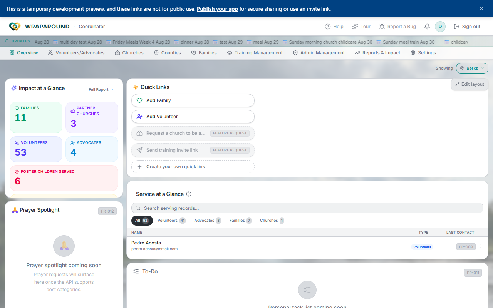

<!-- @frontend verified 2026-08-27 against the dev instance, signed in as the demo
Coordinator: Overview tab, county-scoped Impact at a Glance tiles, and the same
nav tabs as Central Admin all confirmed live. -->

# Getting started for coordinators

As a **coordinator** you have the same full access as program staff, with a view focused on
managing your **county**. You can see and manage every family — every API call the app
makes is automatically scoped to your county, so you never need to filter it yourself.

## Your first day, step by step

1. **Sign in.** Use your invite, set a password, and sign in.
   → [Accept your invite & sign in](../how-to/account/accept-invite.md)
2. **Finish your profile.** Add your details and photo.
   → [Update your profile](../how-to/account/update-profile.md)
3. **Get your bearings on Overview.** Your dashboard opens on **Overview** — a
   draggable panel grid with "Impact at a Glance" stats (Families, Partner Churches,
   Volunteers, Advocates, Foster Children Served), a searchable **Service at a Glance**
   database panel (volunteers, advocates, families, churches — all scoped to your county
   by default), a Prayer Spotlight, and a To-Do panel.
4. **Know your nav.** Across the top: **Overview, Volunteers/Advocates, Churches,
   Counties, Families, Training Management, Admin Management, Reports & Impact,
   Settings.** These are the same tabs a Central Admin sees — the difference is every
   page is filtered to your county behind the scenes, not by anything you configure.
5. **Learn the county-wide workflows.** Day to day, your work is the same as program
   staff, just automatically scoped to your county:
   - [Onboard a family & invite people](../how-to/admin/onboarding.md)
   - [Manage families & people](../how-to/admin/families-and-people.md)
   - [Manage volunteers & advocates](../how-to/admin/volunteers-and-advocates.md)
   - [Oversight: needs, training & audit log](../how-to/admin/oversight.md)
   - [Manage training modules](../how-to/admin/training-management.md)
   - [Manage family agreements](../how-to/admin/family-agreements.md)
   - [Manage reference data](../how-to/admin/reference-data.md)

!!! tip "Reference data is organization-wide, not county-wide"
    Support Types, Volunteer Status, and the other lookup tables under **Admin
    Management → Add/Remove Reference Data** are shared platform-wide — a change you
    make there affects every county, not just yours. See
    [Manage reference data](../how-to/admin/reference-data.md) before editing one.

## What you can do

Your backend access matches an Admin's — see [Roles & who sees what](../concepts/roles-and-visibility.md).
