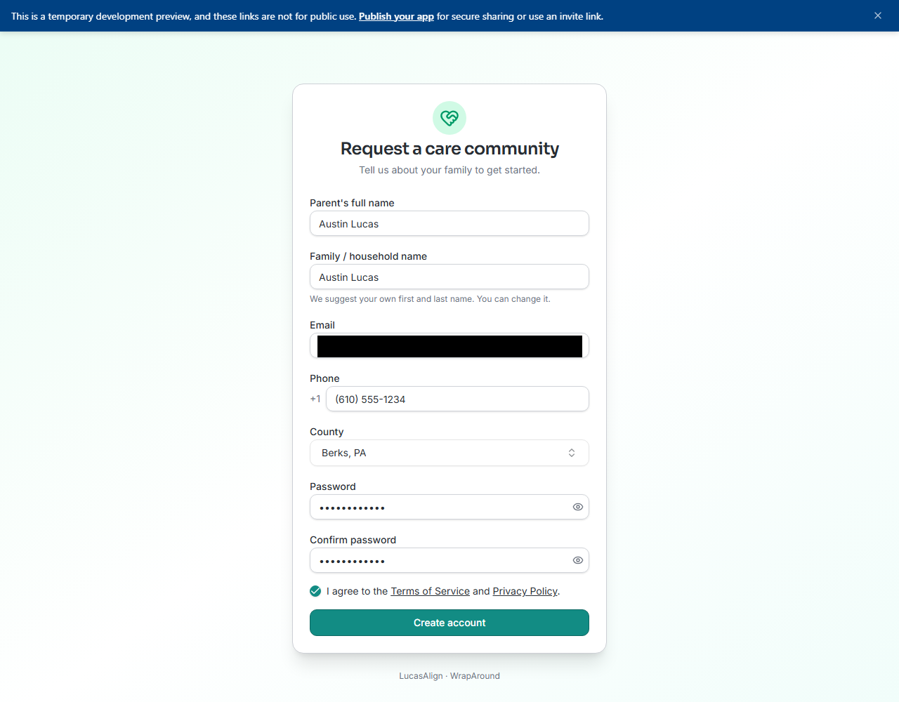
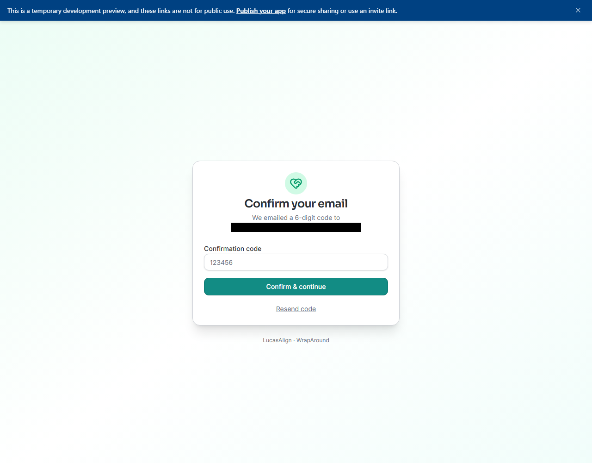
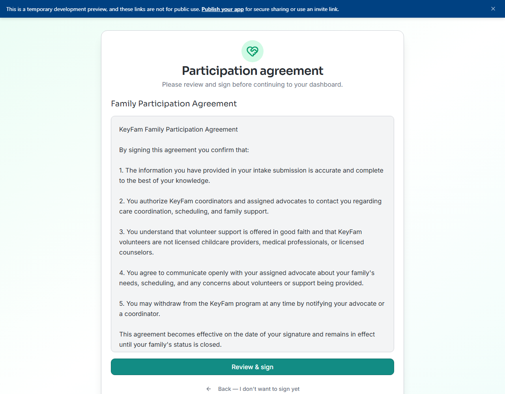
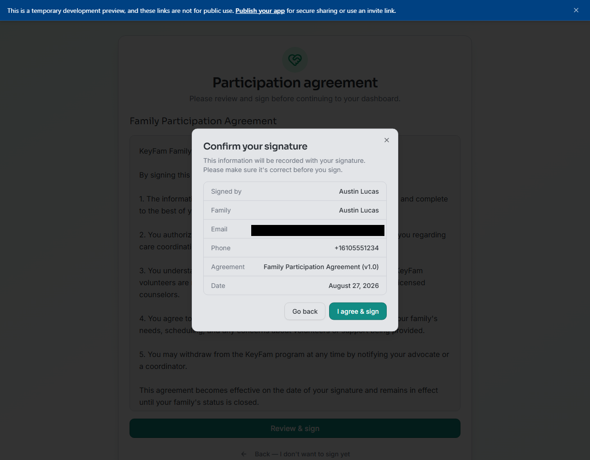
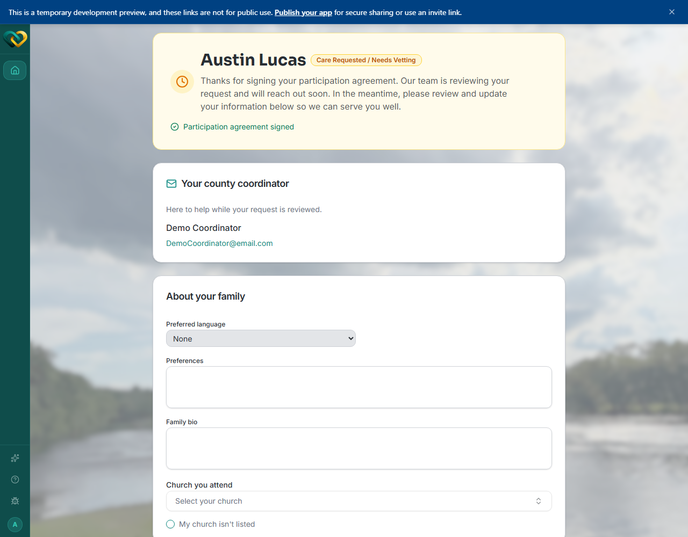

<!-- @frontend verified 2026-08-27 end-to-end live on the dev instance, using a real
throwaway account carried through every step: registration, the emailed 6-digit code,
the participation-agreement signature, and the resulting dashboard while the family sits
in Care Requested / Needs Vetting. Corrected: the post-signature dashboard does NOT show
an advocate, volunteers, needs, or schedule yet (those only appear once staff activate
the family and assign a serving church) — pre-activation it shows the vetting-status
banner, a "Your county coordinators" contact card, and an editable "About your family"
profile form. Also verified live that the same account signs back in later through the
normal site-wide "Sign in" button, same as every other role — a re-login test after this
account was already registered landed cleanly on /family. (An earlier pass here wrongly
guessed from source code alone that family accounts had no return sign-in path; that
guess was wrong and has been retracted.) -->

# Getting started for families

If you're a foster or adoptive parent, WrapAround is where your **care circle** comes
together — the advocate and volunteers helping your family. You'll see **your own family**
only.

## Your first day, step by step

WrapAround is one of the few roles that **doesn't require a staff invite** — you can
register yourself.

1. **Register your family.** Go to the family signup page (your local program can give
   you the link) and fill in the **Request a care community** form: your name as the
   primary parent, a family/household name (it starts prefilled with your name — change
   it if you'd rather use something else), your email, a US phone number, and your
   **county**. Set a password, agree to the Terms of Service and Privacy Policy, and
   click **Create account**.

   

2. **Confirm your email.** WrapAround emails you a 6-digit code. Enter it on the
   **Confirm your email** screen and continue — this signs you in automatically.

   

3. **Sign the participation agreement.** Before you can reach your dashboard, you're
   asked to review and sign your program's active **participation agreement**. Read it,
   click **Review & sign**, check the identity details shown (name, family, email, phone,
   agreement version, date), and click **I agree & sign**.

   

   

4. **Land on your dashboard.** Right after signing, your family is in **Care Requested /
   Needs Vetting** — so what you see is a status banner, your **county coordinators'**
   contact details, and an editable **About your family** profile (preferred language,
   preferences, family bio, church, and how volunteers can help). Take a few minutes to
   fill this in; it helps staff place you.

   

   !!! info "What to expect next"
       Your care request has been sent to your county's coordinators. Watch for an email
       from the system that includes you and your coordinators — this is meant to help
       start the conversation. Expect your coordinator to reach out to schedule an
       **intake call**, where they'll go through your family profile information with
       you.

       Filling in your profile ahead of time can help speed things up, but if you're not
       sure what to put or have questions, it's fine to leave it and wait — your
       coordinator can enter information on your behalf during the call, and can see
       whatever you've already filled in.

   Your full circle — an assigned **advocate**, **volunteers**, **needs**, and a
   **schedule** — appears once staff review your request and activate your family with a
   serving church.
   → [View your family](../how-to/family/view-your-family.md)

!!! tip "Already have an account?"
    If your family was set up by staff instead of self-registering, you'll get an invite
    email instead of using the signup form — see
    [Accept your invite & sign in](../how-to/account/accept-invite.md).

    Registered yourself already? Signing back in later works the same way as any other
    role — from the home page choose **Sign in**, then enter your email and password.

!!! note "Care Requested / Needs Vetting"
    Right after signing the agreement, your family starts in a **vetting** status while
    your program reviews your request. An advocate or coordinator moves you forward from
    there.

## What you can do

WrapAround gives you a window into your own care circle:

- See your family's circle — your advocate and the volunteers helping you.
- See the **needs** raised for your family and who's helping with each.
- See your family's **schedule**.

Creating needs, claiming tasks, and managing the schedule are handled by your advocate,
program staff, and volunteers — so you can stay focused on your family.

New here? Start with [What is WrapAround?](../concepts/what-is-wraparound.md).
