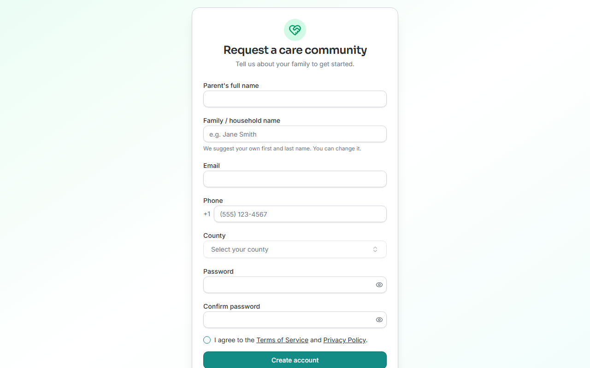

<!-- @frontend: verified 2026-08-26 against Align-FrontEnd's family-signup.tsx /
family-agreement.tsx source and the live demo at /family-signup — the registration
form fields, headings, and button text below match the shipped code exactly, and
the form screenshot was captured live. The **sign-in-after-registering** and
**dashboard** screenshots could NOT be captured: the demo's WA_FAMILY_USER/PASS
credentials (from WrapAround-Testing-Suite's .env) return "Incorrect username or
password" against the same Cognito hosted-UI flow that works for every other role.
Two theories, unconfirmed: (1) that demo account was provisioned before/outside the
family self-registration flow and was never migrated into whatever Cognito app
client family accounts actually authenticate against, or (2) the family sign-in
flow doesn't reuse the main "Sign in" button/hosted-UI client at all and needs a
distinct entry point this pass didn't find. Someone with access to reset that demo
account's password (or who knows the intended returning-family sign-in path)
should confirm before this page reaches status: ready, and a dashboard screenshot
(fam-dashboard.png, matching adv-dashboard.png/vol-dashboard.png/coord-dashboard.png)
should be captured then. -->

# Getting started for families

If you're a foster or adoptive parent, WrapAround is where your **care circle** comes
together — the advocate and volunteers helping your family. You'll see **your own family**
only.

## Your first day, step by step

WrapAround is one of the few roles that **doesn't require a staff invite** — you can
register yourself.

1. **Register your family.** Go to the family signup page (your local program can give
   you the link) and fill in the **Request a care community** form: your name as the
   primary parent, a family/household name (it starts prefilled with your name — change
   it if you'd rather use something else), your email, a US phone number, and your
   **county**. Set a password, agree to the Terms of Service and Privacy Policy, and
   click **Create account**.

   

2. **Confirm your email.** WrapAround emails you a 6-digit code. Enter it on the
   **Confirm your email** screen and continue — this signs you in automatically.
3. **Sign the participation agreement.** Before you can reach your dashboard, you're
   asked to review and sign your program's active **participation agreement**. Read it,
   click **Review & sign**, check the identity details shown (name, family, email, phone,
   agreement version, date), and click **I agree & sign**.
   <!-- @frontend: confirm live — could not reach this screen this pass since the
   demo family account couldn't sign in. Mechanism confirmed from family-agreement.tsx
   source: GET /agreements/active gates ProtectedRoute until signed. -->
4. **Land on your dashboard.** You'll see your family's care circle — your advocate and
   the volunteers helping you — plus your needs and schedule.
   → [View your family](../how-to/family/view-your-family.md)

!!! tip "Already have an account?"
    If your family was set up by staff instead of self-registering, you'll get an invite
    email instead of using the signup form — see
    [Accept your invite & sign in](../how-to/account/accept-invite.md).

!!! note "Care Requested / Needs Vetting"
    Right after signing the agreement, your family starts in a **vetting** status while
    your program reviews your request. An advocate or coordinator moves you forward from
    there.

## What you can do

WrapAround gives you a window into your own care circle:

- See your family's circle — your advocate and the volunteers helping you.
- See the **needs** raised for your family and who's helping with each.
- See your family's **schedule**.

Creating needs, claiming tasks, and managing the schedule are handled by your advocate,
program staff, and volunteers — so you can stay focused on your family.

New here? Start with [What is WrapAround?](../concepts/what-is-wraparound.md).
