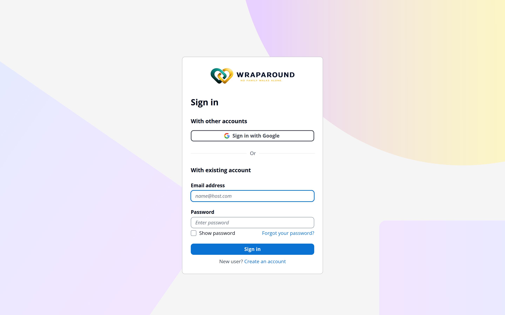

# Accept your invite & sign in

**Who this is for:** Anyone joining WrapAround — volunteers, advocates, and program staff.
**When to use it:** The first time you join, after the program emails you an invite.
**Before you start:** An invite email sent to your address. The temporary password in it
expires after **7 days**, so use it promptly — if it's expired, ask staff to resend.

## Steps

1. Open the **invite email** from WrapAround. The sender name is **WrapAround** and the
   address ends in **@lucasalign.com** (for example, `demo.WrapAround@lucasalign.com`). The
   email includes a **sign-in link**, your **email address**, and a **temporary password**.
2. Select the **sign-in link**, choose **Sign in**, and enter your **email address** and
   the **temporary password** from the email.
3. When prompted, **create your own permanent password** — at least 8 characters, with a
   number, an uppercase letter, and a special character.
4. Sign in again with your new password. WrapAround finishes setting you up. After this,
   sign in any time from the home page: choose **Sign in**, then enter your email and
   password.

## What you'll see

Once you're signed in, you land on your **dashboard** — your home base in WrapAround. From
here you can reach your family, needs, schedule, and messages.

!!! tip "Temporary password expired?"
    If you don't sign in before the 7-day window is up, don't worry — you don't need a
    fresh invite. On the sign-in screen, choose **Forgot your password?** and follow the
    steps to set a new password yourself, using the same email the invite was sent to.

!!! tip "Use your invited email"
    Sign in with the **same email address** the invite was sent to. That address is how
    WrapAround connects you to the right family and role.

## Related

- [Update your profile](update-profile.md)
- [Upload your photo](upload-photo.md)
- [Didn't get your invite, or can't sign in?](../../reference/troubleshooting.md)
