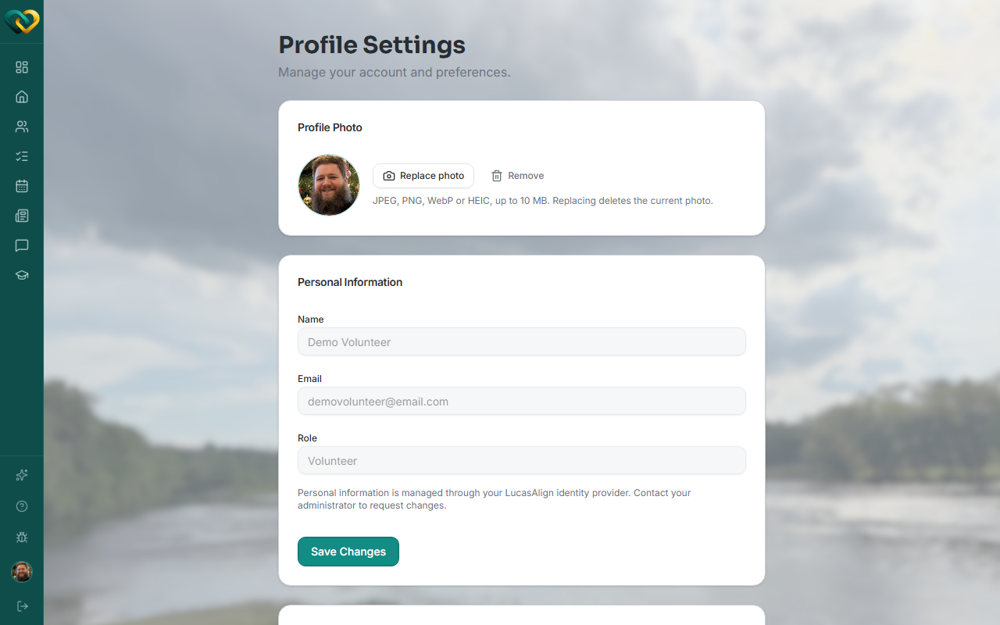

<!-- @frontend verified live 2026-08-26 as WA_VOLUNTEER_USER against
     https://demo.wraparound.lucasalign.com/profile. The control is a "Replace photo"
     button next to your current photo/avatar (plus a separate "Remove" button) — not the
     avatar itself. No crop step; the file uploads as-is. -->

# Upload your photo

**Who this is for:** Everyone with a WrapAround account.
**When to use it:** To put a face to your name so your care circle recognizes you.
**Before you start:** You've [accepted your invite and signed in](accept-invite.md), and
you have a photo on the device you're using.

## Steps

1. Click your photo/initials in the sidebar, or go to **Profile Settings**.
2. Under **Profile Photo**, click **Replace photo**.

    

3. Choose a photo from your device — **JPEG, PNG, WebP, or HEIC**, up to **10 MB**.
4. Your photo uploads and replaces the one shown. There's no separate confirm step and
   no cropping — the photo you pick is the photo that's used.

## What you'll see

Your new photo appears next to your name across WrapAround — on messages, claims, and
the schedule — so the team can recognize you.

!!! warning "Replacing deletes the old photo"
    WrapAround says this plainly on the page: replacing your photo **deletes the current
    one**. There's no way to go back to it — pick a photo you're happy keeping.

!!! tip "Pick a clear, friendly photo"
    A simple headshot works best. Avoid group photos so people can tell which face is yours.

## Related

- [Update your profile](update-profile.md)
