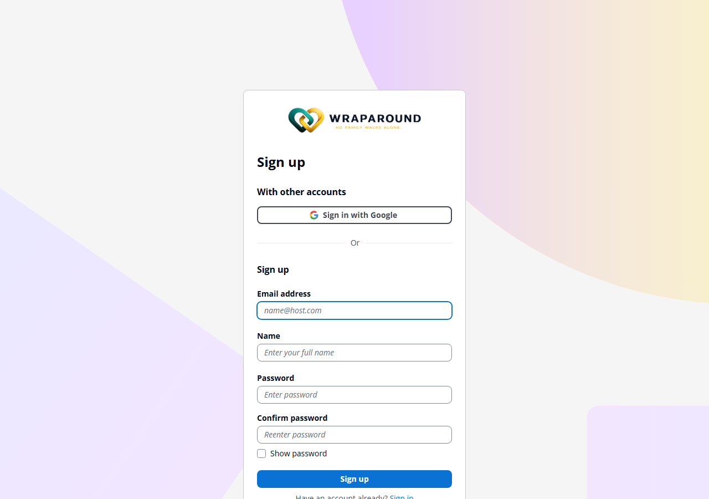
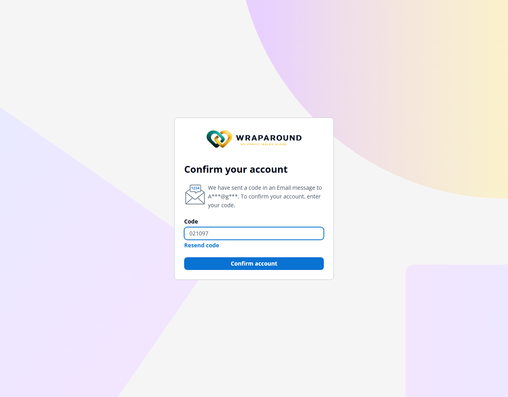
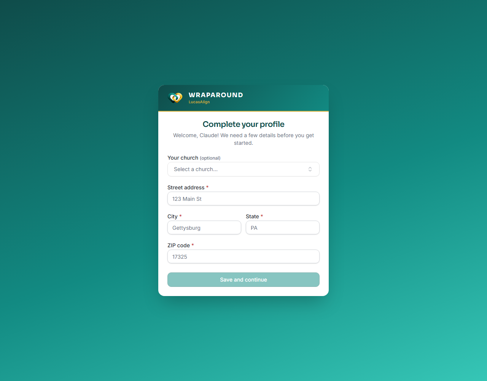
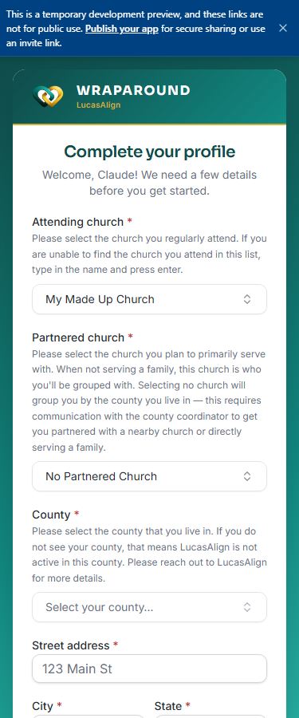

<!-- @frontend verified live end-to-end 2026-08-27, using two real throwaway accounts
carried all the way through signup, email verification, and profile completion:

- Cognito's native "New user? Create an account" link, sign-up form, and live
  password-rule validation — confirmed on demo.wraparound.lucasalign.com.
- Email verification code + the post-verification "Complete your profile" screen —
  confirmed by actually receiving and entering a real code, twice.
- The church/partnered-church/county cascade below is confirmed ONLY on the dev
  instance (https://e609f495-...janeway.replit.dev), NOT yet on
  demo.wraparound.lucasalign.com. The two environments currently disagree on this
  screen: on demo, the field is "Your church (optional)" with a plain list and no
  free-text option, no Partnered church field, and no County field — selecting nothing
  and continuing lands straight in Training. On dev, the field is "Attending church"
  (required) with the type-to-add-a-church + Partnered church + County cascade
  described below. Re-check which behavior is live on demo before publishing this
  page, since it directly contradicts what demo does today. -->

# Sign up as a volunteer

**Who this is for:** Anyone who wants to volunteer with WrapAround, without waiting for
an invite.
**When to use it:** You want to create your own volunteer account right away.
**Before you start:** Nothing — but if a church or program already has a relationship
with WrapAround, using an email your church leaders can recognize helps them place you.

## Steps

1. Go to your organization's WrapAround sign-in page (e.g. `demo.wraparound.lucasalign.com`) and choose **Sign in**.
2. At the very bottom of the sign-in form, choose **New user? Create an account**.

    

3. On the **Sign up** form, enter your **email address**, **full name**, and a password, then confirm it.

    

    Your password needs to be at least 8 characters and include a number, an uppercase letter, and a special character — the form validates each requirement as you type.

4. Choose **Sign up**. You'll be sent an email with a verification code — enter it on the **Confirm your account** screen and choose **Confirm account**.

    

5. You land on **Complete your profile**. Select your **attending church** from the list, then fill in your **street address**, **city**, **state**, and **ZIP code**.

    

6. Choose **Save and continue**.

## If your church isn't in the list

Don't pick the closest match — type your church's actual name and a **Use "‹what you typed›"** option appears below the field; select it.

Adding a church this way opens a second required field, **Partnered church** — the church you'll primarily serve with when you're not placed with a family. Pick one from the list, or choose **No Partnered Church** if none fits.

Choosing **No Partnered Church** opens a third required field, **County** — the county you live in. If your county isn't listed, WrapAround isn't active there yet; the form tells you to contact the program directly rather than letting you continue.

!!! tip "This cascade may not be live yet"
    As of this writing it only appeared on the WrapAround dev/preview environment, not
    the public demo site — the field there is simpler (optional, pick-from-list only,
    no free-text option). If you're not seeing the extra fields described above, your
    organization may not have this version yet — leaving attending church blank and
    continuing still works.

## What you'll see

Next you'll be taken into [training](../training/modules-and-progress.md) — complete any assigned modules before program staff can place you with a family.

!!! tip "Already have an invite instead?"
    If a program or advocate already invited you by email, don't sign up here — follow
    [Accept your invite & sign in](accept-invite.md) instead, using the same email the
    invite was sent to.

## Related

- [Accept your invite & sign in](accept-invite.md)
- [Get started as a Volunteer](../../get-started/volunteers.md)
- [Find your modules & track progress](../training/modules-and-progress.md)
