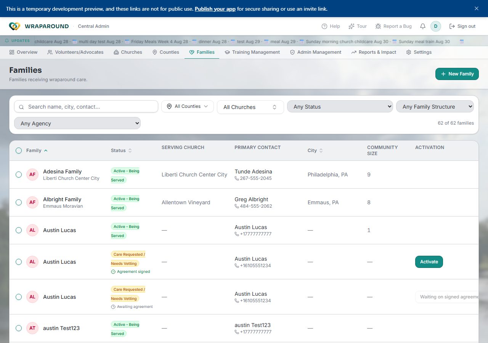
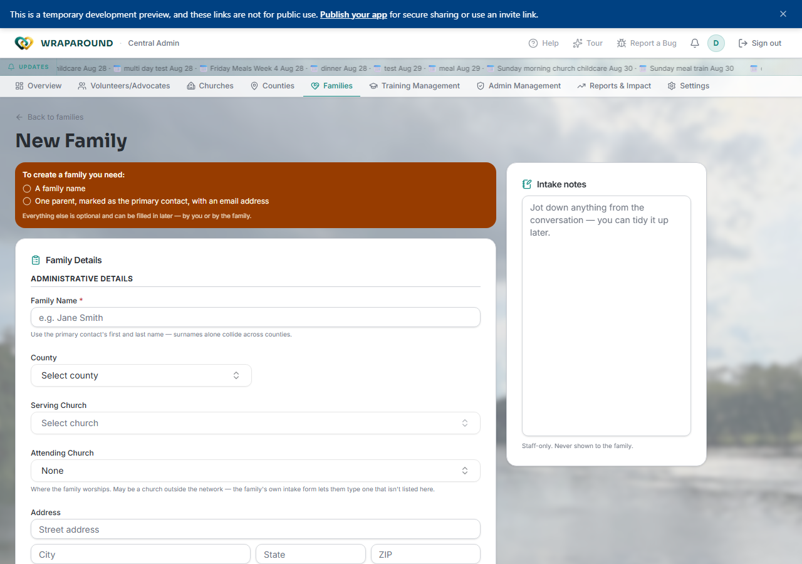
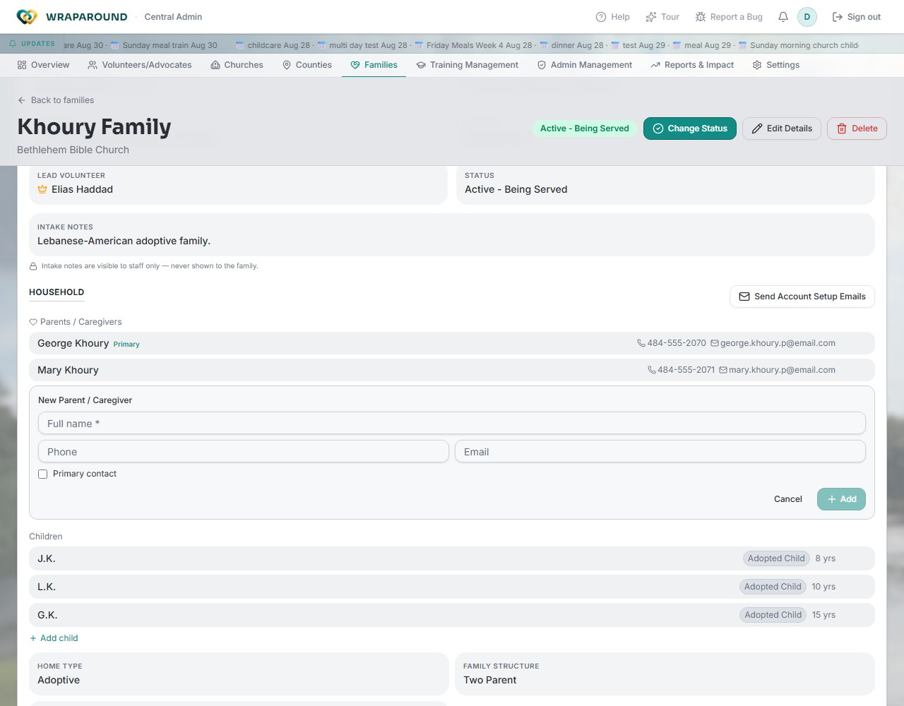
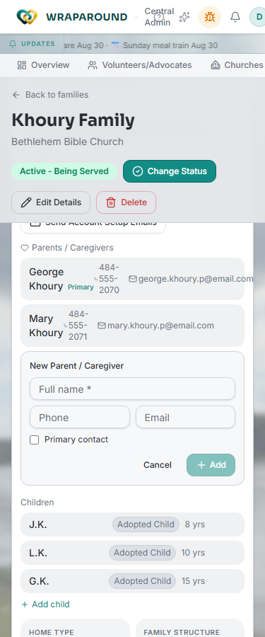

<!-- @backend verified: a "community" IS a family (1:1 merge); the family is the WrapAround
     care circle. Family records hold parents and children; one parent is the primary contact.
     CSV import of families is supported and every import is written to the audit log. -->

# Manage families & people

**Who this is for:** Program staff (Admins and Coordinators); advocates for their church's
families.
**When to use it:** When you set up a new family or update who's in one.
**Before you start:** You're signed in with staff access.

## The family is the care circle

In WrapAround a **family** *is* the care circle — everything else is organized
around it. A family record holds its **parents** and **children**, with one parent set as
the **primary contact**. Each family also contains lots of information regarding the family and how they can be served.

## Add a family - Admin only
**NOTE:**
While working in this new family page your changes will be saved as you go. This means you can refresh, navigate to other pages or tabs to look up information and when you return your changes will still be there. There will be a small message at the top of the page saying "Restored your unsaved draft from 9:19 PM. Nothing has been created yet." This prompt will have an option to clear all fields. If you want to discard all of your changes instead of having them saved as a draft, go to the bottom of the page and click cancel. The information you have filled in is saved locally in your browser, it will survive a refresh, but it will **not** survive closing and re-opening the tab.

1. Open **Families** and choose **New Family**.
2. Fill in, at minimum, the **Family Name** and **Primary Contact** information.
	- **Family Name** This is not forced as a unique value, but ideally you don't want duplicate family names. You will be warned if the family name you have entered is a duplicate. Current best practice is to use the first and last name of the primary contact.
	- **Primary Contact** means adding a parent with a name, email address, and checking the primary contact checkbox.
	- **NOTE:** The **Create Family** button will be disabled until you have entered at least these two items.
3. Clicking on **Create Family** will create the family, save all your entered data, and then take you directly to the new family page.

<!-- @frontend verified 2026-08-27 against the dev instance, signed in as the demo
Central Admin: /families/new shows a "To create a family you need" callout (Family
Name; one parent marked primary contact with an email), plus County, Serving Church,
Attending Church, and Address fields, and a staff-only "Intake Notes" side panel not
previously documented. -->

## Update a family

1. Open the family from **Families**.
2. Click on **Edit Details** in the top right.
3. Make any changes you want.
4. **Save** your changes by clicking **Save changes** in the top right.

## Add a parent or child to a family — Admin/Coordinator only

<!-- @frontend verified live 2026-08-27: confirmed this control is genuinely gated to
Admin/Coordinator. Signed in as DemoAdvocate on the same family, the Household section
shows no "Add parent"/"Add child" control anywhere — not on the read-only Overview, not
inside Edit Details. Signed in as DemoAdmin, both controls are present and work as
described below. This contradicts ADVOCATE_ROLE.md's claim that advocates manage a
family's "parents, children" — that claim is stale for this specific action. -->

1. Open the family and scroll to its **Household** section.
2. Under **Parents / Caregivers**, click **+ Add** (or **Add child** under **Children**).
3. An inline form opens. For a parent: enter **Full name** (required), optionally **Phone** and **Email**, and check **Primary contact** if this person is the family's main point of contact.

    

    

4. Click **Add**.

**What you'll see:** the new parent or child appears immediately in the Household list.

!!! tip "Advocates can't do this"
    Adding a parent or child is Admin/Coordinator-only — the control doesn't appear for
    Advocates, even ones who can otherwise edit the same family's profile. An advocate
    who needs a parent or child added has to ask program staff.

## Family photo

### Adding or Updating a photo
1. Open the family,
   - if the family has no photo hover over the photo box and click **Add**.
   - if the family has an out-of-date photo, hover over the existing photo and click **Change**.
2. Choose the new image and confirm to upload.

### Removing a family photo
1. Open the Family.
2. Hover over the family photo and click remove.

!!! warning "Never use real PII in examples or templates you share"
    Family information is sensitive. Keep any exported or filled-in CSV files secure and out
    of shared locations.

## Related

- [Manage volunteers & advocates](volunteers-and-advocates.md)
- [Onboard a family & invite people](onboarding.md)
- [Manage churches & counties](organizations.md)
- [Oversight](oversight.md)
