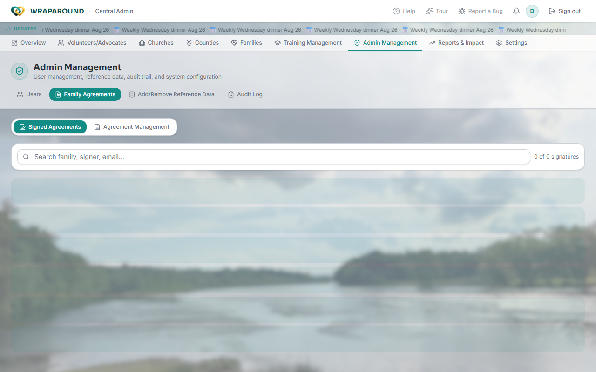
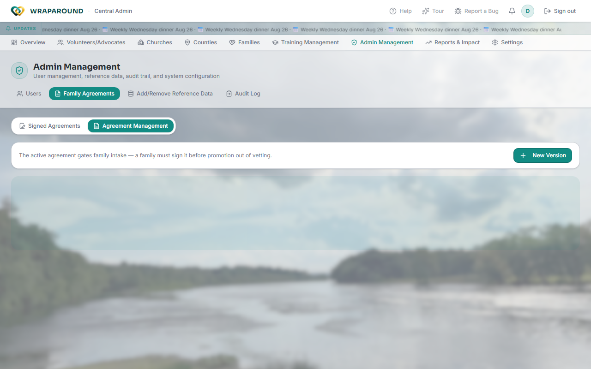

# Manage family agreements

**Who this is for:** Central Admin, Coordinator.
**When to use it:** To view signed participation agreements, or to write/update the
agreement text families sign when they register.
**Before you start:** Nothing.

## Steps

1. Open **Admin Management** from the top nav, then click the **Family Agreements** tab.

    

2. There are two sub-tabs:
    - **Signed Agreements** — a read-only, searchable list of every family's signature:
      who signed, when, which agreement version, and their county. Filter by agreement
      version or county, or search by family/signer/email.
    - **Agreement Management** — the current active agreement template plus its full
      version history.

    

3. To change the agreement text, click **New Version**. In the **New Agreement Version**
   dialog, fill in the version number, title, and full agreement body, and check the box
   if you want to activate it immediately. Click **Create**.
   <!-- @frontend verified 2026-08-27 against AgreementEditorModal in admin-management.tsx:
   the dialog title is "New Agreement Version" and the confirm button reads "Create" in
   create mode (it reads "Save" only when editing an existing unsigned version). -->
4. To make an existing draft version the one families sign, open it and click
   **Activate**. A version that already has signatures against it is **locked** — you
   can view it but can't edit its text (editing it would retroactively change what
   families already agreed to); create a new version instead.
5. To view or print a specific agreement's full text, click the eye icon next to it.

## What you'll see

- The **active agreement** gates family intake: a family can't be promoted out of
  vetting until they've signed the currently-active version.
- Signing happens automatically as part of [family self-registration](../../get-started/families.md)
  — this page is for the admin side (writing/versioning the text and reviewing who's
  signed), not for signing it yourself.

!!! tip "One agreement is active at a time"
    Creating a new version doesn't retire the old one automatically unless you choose to
    activate it. Families who already signed an earlier version keep that signature on
    record — a new version only applies going forward.

## Related

- [Getting started for families](../../get-started/families.md)
- [Manage families & people](families-and-people.md)
