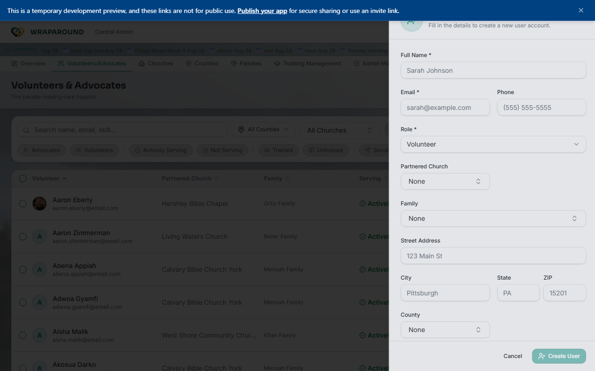

<!-- @backend verified: onboarding is email-invite based; invite links are secure and
     expire (typically 7 days). A newly self-registered family starts at "Care Requested /
     Needs Vetting" and must be approved by staff before becoming active. -->

<!-- @frontend verified 2026-08-27 against the dev instance, signed in as the demo
Central Admin: the "Invite New User" form (Full Name, Email, Phone, Role, Partnered
Church, Family, Street Address, City, State, ZIP, County) confirmed live from
Volunteers/Advocates → Create New User. -->

# Onboard a family & invite people

**Who this is for:** Program staff (Admins and Coordinators); advocates for their church.
**When to use it:** When you bring a new family into WrapAround and invite the people who'll
support them.
**Before you start:** You're signed in with staff access.

## Onboard a family

1. [Create the family record](families-and-people.md) — complete the family profile and information gathering.
2. Make sure the new family is configured with the right **county** and **serving church**. **Serving Church** is important since it's what gives that church's advocates access to see the family. → [Manage churches & counties](organizations.md)
   - It's also possible to manually assign individual advocates to a family. This is for the edge case where a serving church doesn't have any fully trained advocates yet — once it does, the newly trained advocates automatically gain access to the family too.
3. At this point it's also possible to assign volunteers.
4. You won't be able to **Activate** or change a family's status from **Care Requested / Needs Vetting** until a parent or caregiver signs into WrapAround and signs the family agreement — see
   [Manage family agreements](family-agreements.md) for the staff-facing side of that agreement.

### Activating a family.

All families, regardless if an admin or coordinator does the onboarding, or a family self-registers, they do not go live automatically. They all start at **Care Requested / Needs Vetting** and require a parent or care-giver to sign in to Wraparound and sign a family agreement

1. Open **Families**. A family awaiting review carries the **Care Requested / Needs Vetting**
   status — use the **Status** filter to list them.
2. Review the details, then **approve** the family (change its status) to move it into active
   service.
   → [Statuses explained](../../reference/statuses.md)

## Invite a person

1. From **Volunteers/Advocates**, choose **Create New User** and fill in the person's name,
   email, and role. → [Manage volunteers & advocates](volunteers-and-advocates.md)
2. They get an email to [accept and set a password](../account/accept-invite.md).

## Resend an invite

<!-- @frontend verified 2026-08-27 against Align-FrontEnd's volunteers.tsx and
volunteer-invite-actions.ts: the control is a row-hover key icon titled "Send new temp
password" on Volunteers/Advocates, opening a "Send New Temp Password" dialog with a
"Copy Email Message" button. It only appears while the person's account is still
awaiting their first sign-in (Cognito status FORCE_CHANGE_PASSWORD) — once they've
signed in and set their own password, the icon disappears since there's no invite left
to resend. -->

If someone didn't get their invite or their temporary password expired:

1. On **Volunteers/Advocates**, hover their row and select the **key icon** ("Send new
   temp password"). This only appears while they haven't signed in yet.
2. In the **Send New Temp Password** dialog, choose **Send New Temp Password** to issue
   a fresh one (this invalidates their previous one), then **Copy Email Message** to
   send it to them yourself if the automatic email doesn't reach them.

!!! tip "Temporary passwords expire"
    A temporary password is time-limited (typically 7 days). If someone waited too
    long, send a new one rather than troubleshooting the old one.

## Related

- [Manage families & people](families-and-people.md)
- [Manage volunteers & advocates](volunteers-and-advocates.md)
- [Troubleshooting](../../reference/troubleshooting.md)
