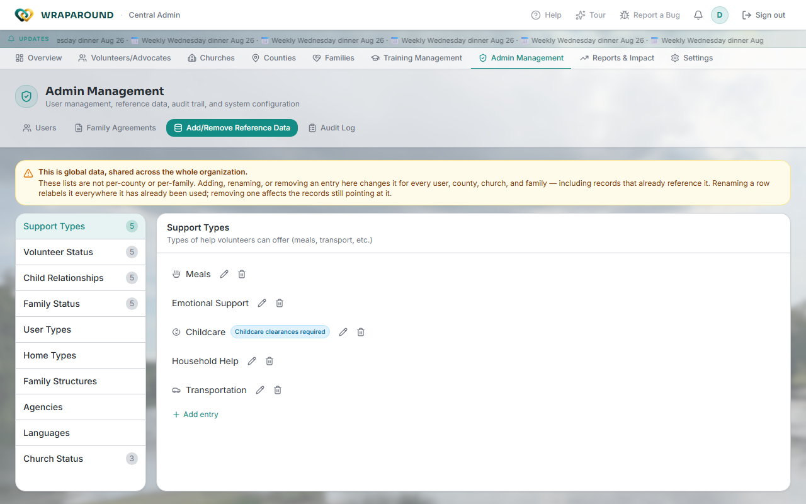

# Manage reference data

**Who this is for:** Central Admin, Coordinator.
**When to use it:** To add, rename, or remove the values in WrapAround's shared lookup
lists — the dropdown options used across every family, church, and county.
**Before you start:** Nothing, but read the warning below before renaming or removing
anything.

## Steps

1. Open **Admin Management** from the top nav, then click **Add/Remove Reference Data**.

    

2. Pick a table from the left-hand list. The tables you'll manage here are:

    | Table | What it controls |
    |---|---|
    | Support Types | The kinds of help volunteers can offer (Meals, Transportation, Childcare, etc.) |
    | Volunteer Status | Volunteer onboarding status values |
    | Child Relationships | Relationship types between a child and their caregiver |
    | Family Status | Care-circle status values for families (vetting, active, etc.) |
    | User Types | Platform user type classifications |
    | Home Types | Type of foster home (Foster to Adopt, Kinship, Traditional, etc.) |
    | Family Structures | Household composition (Two Parent, Single Mother, Grandparent-Led, etc.) |
    | Agencies | Partner agencies that place or oversee families |
    | Languages | Preferred household languages, for language-matched support |
    | Church Status | Partnership status for churches (Prospective, Partnered, Inactive, etc.) |

3. On the right, each entry has a pencil (edit) and trash (delete) icon. Click **Add
   entry** at the bottom of the list to create a new value.
4. Some tables carry an extra flag alongside the name — for example, a Support Type can
   be marked **Childcare clearances required**, which restricts who can claim needs of
   that type to childcare-approved volunteers. Set that when editing the entry.
5. Confirm deletions when prompted.

## What you'll see

Changes apply immediately, everywhere the value is used.

!!! warning "This is global, organization-wide data"
    These lists are **not** per-county or per-family. Renaming an entry relabels it on
    every record that already points at it, across every county, church, and family.
    Removing one affects records still referencing it. There's no per-county copy of
    "Support Types" — a coordinator editing this table changes it for the whole
    organization, not just their county.

!!! tip "Home Types, Family Structures, Agencies, and Languages start empty"
    These four tables ship with no seed data — every organization populates them from
    its own data. Don't be surprised to find them empty on a fresh tenant.

## Related

- [Manage families & people](families-and-people.md)
- [Manage volunteers & advocates](volunteers-and-advocates.md)
