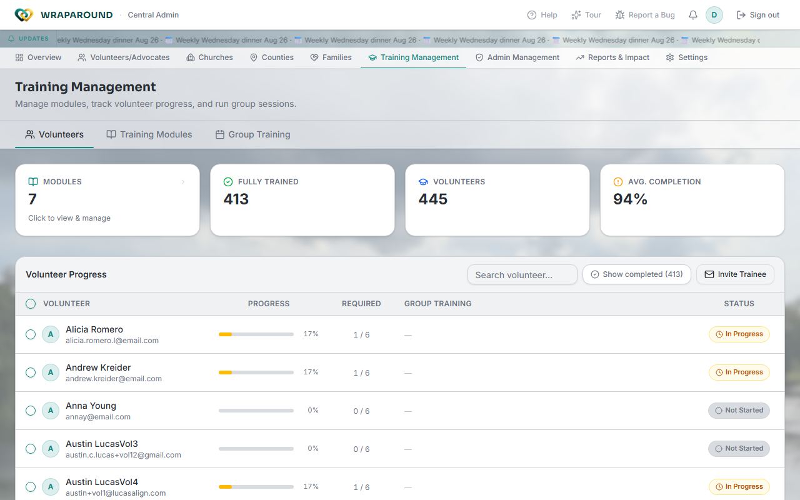

# Manage training modules

**Who this is for:** Central Admin, Coordinator (coordinators see their own county's
volunteers; central admins see everyone).
**When to use it:** To create or change training content, control which modules are
required, and check on training progress and group sessions across the whole
organization (or your county).
**Before you start:** Nothing.

## Steps

1. Open **Training Management** from the top nav.

    

2. The page has three tabs:
    - **Volunteers** — a progress matrix: every volunteer, their completion percentage,
      how many required modules they've finished (e.g. "1 / 6"), whether they're in a
      group training session, and their status (**In Progress** / **Not Started** /
      completed). Search by name, or toggle **Show completed** to include volunteers
      who've finished everything. **Invite Trainee** starts onboarding for a new
      volunteer from here.
    - **Training Modules** — create, edit, delete, and reorder the modules themselves,
      and mark a module **mandatory** (required) or optional.
      <!-- @frontend: confirm exact control labels/layout on this tab — this pass
      confirmed the tab exists and its purpose from training-management.tsx, but
      didn't click all the way into module create/edit/reorder controls live. -->
    - **Group Training** — see and manage group training sessions across every family/
      church in your scope, not just the ones you personally lead.
      <!-- @frontend: confirm exact controls here too, same caveat as above. -->
3. To change what's required, mandatory, or in what order, use the **Training Modules**
   tab. To check on an individual volunteer's progress, use **Volunteers** and search
   for their name.

## What you'll see

- The four summary tiles at the top (**Modules**, **Fully Trained**, **Volunteers**,
  **Avg. Completion**) update immediately as data changes.
- A coordinator's view is automatically scoped to their county — the same page,
  narrower dataset.

!!! tip "This is different from a volunteer's own Training page"
    Volunteers and lead volunteers see a personal progress view under **Training** in
    their own nav — see [Find your modules & track progress](../training/modules-and-progress.md).
    **Training Management** is the admin content-management screen: it's where the
    modules themselves get created and where you see everyone's progress, not just your
    own.

## Related

- [Find your modules & track progress](../training/modules-and-progress.md) (the
  volunteer's own view)
- [Start a group training session](../advocate/start-group-training.md)
- [Oversight: needs, training & audit log](oversight.md)
