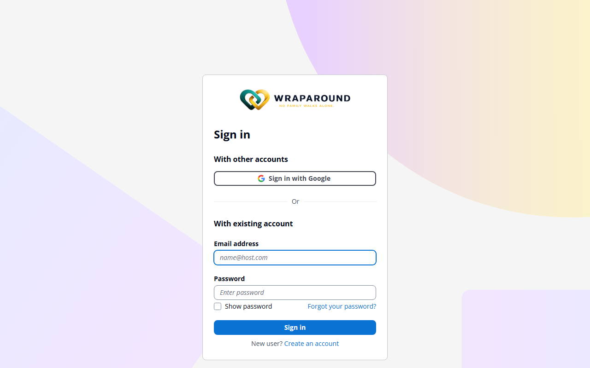

# Accept your invite

**Who this is for:** Advocate (also applies to Volunteers invited directly by an Admin or Advocate)
**When to use it:** The first time you sign in, after program staff or an advocate has created your account.
**Before you start:** You need the invite email sent to the address staff used to create your account.

<!-- @backend: confirm the temporary password expiry window for onboarding-invite accounts (distinct from the 7-day self-registration link expiry documented elsewhere). -->

## Steps

1. Open the invite/welcome email and find your **temporary password**.
2. Go to your organization's WrapAround sign-in page and choose **Sign in**.

    

3. Enter the email address the invite was sent to, and the temporary password.
4. When prompted, set a new permanent password: at least 8 characters, including a number, an uppercase letter, and a special character.
5. Sign in again with your new password.

## What you'll see

If you haven't completed your assigned training yet, you're taken straight to **Training**. Once training is complete, you land on your normal dashboard — for an Advocate, this is **Managed Care Communities**, showing the families your church serves.

!!! tip "Not sure which email to use?"
    Invites always go to the exact address staff entered when creating your account. If sign-in fails, double check you're using that address, not a personal alternate.

## Related

- [How to complete personal training](../training/modules-and-progress.md)
- [Troubleshooting](../../reference/troubleshooting.md)
