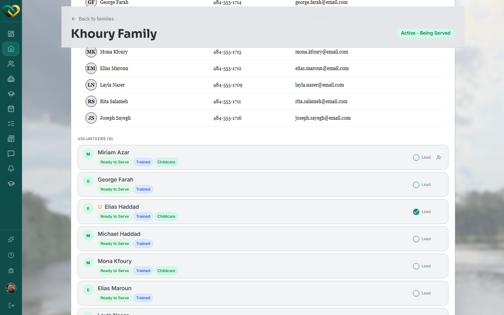

# Assign a volunteer as Lead to a family

**Who this is for:** Advocate
**When to use it:** To give a trusted volunteer extra abilities — like creating or removing needs — within the one family they're assigned to.
**Before you start:** The volunteer must already be on the family's care team.

## Steps

1. Open the family and go to its **Care Team** tab.
2. Find the volunteer in the **Volunteers** list.
3. Toggle **Lead** on for that volunteer.

    

## What you'll see

A small crown icon appears next to the volunteer's name in the Care Team list, marking them as Lead. They can now create and remove needs for this family. This ability is scoped to this one family — a Lead Volunteer on one family isn't a Lead anywhere else.

## Related

- [Manage a family's care team](manage-a-familys-care-team.md)
- [Roles & who sees what](../../concepts/roles-and-visibility.md)
