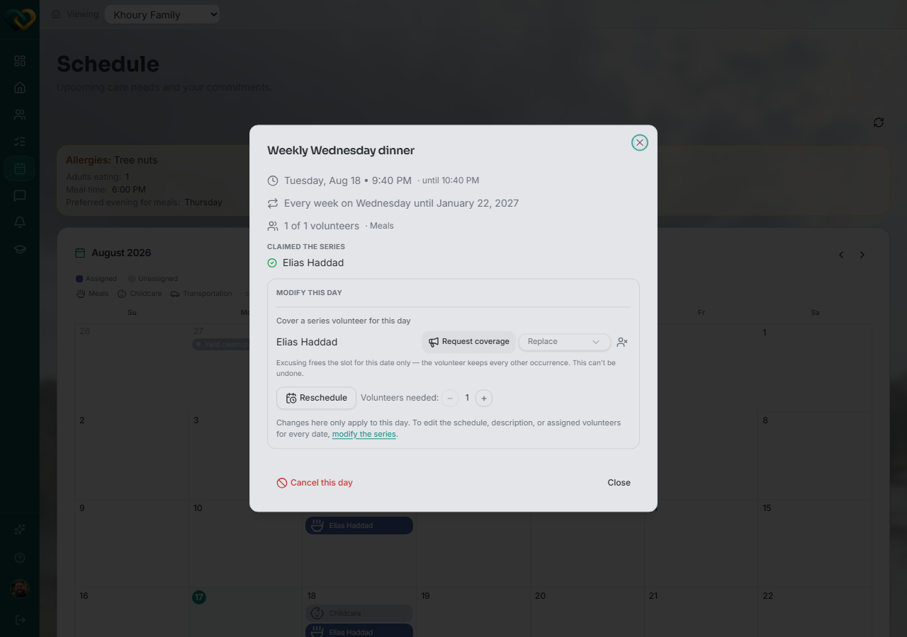

# Assign a volunteer to cover a single day of a recurring need

**Who this is for:** Advocate, Lead Volunteer
**When to use it:** When one occurrence of a recurring need still needs a volunteer, without changing who's assigned to the rest of the series.
**Before you start:** The recurring need must already exist.

## Steps

1. Open **Schedule** and click the day that needs coverage. If the day has more than one item, click **This day** on the specific occurrence.
2. In the day's detail dialog, under **Modify this day**, use **Replace** to pick a volunteer for that date only.

## What you'll see

Only the selected date shows the new volunteer — every other date in the series keeps its existing assignment (or stays **Unassigned**).

## Related

- [Change volunteer assignments on recurring needs](change-recurring-assignments.md)
- [Request coverage on behalf of a volunteer](request-coverage.md)
