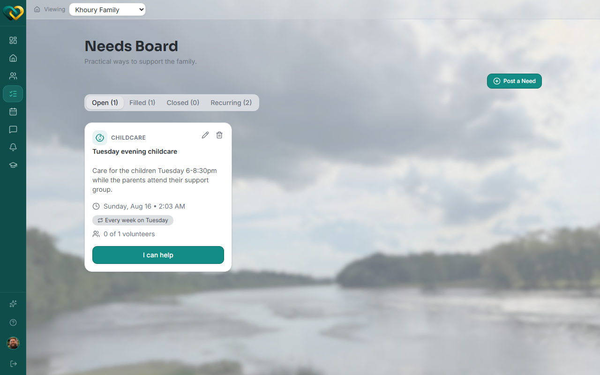
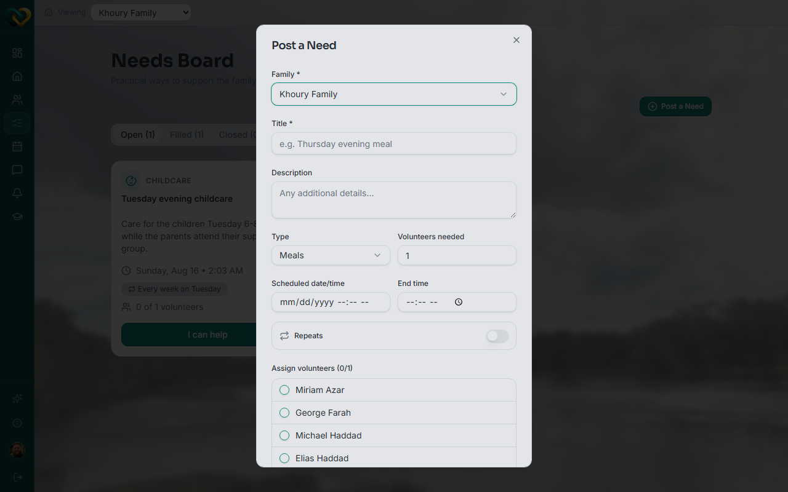

# Create a one-time need

**Who this is for:** Advocate, Lead Volunteer
**When to use it:** To ask for help with a specific, non-repeating task — a meal, a ride, supplies.
**Before you start:** Nothing — you can post a need for any family you serve.

## Steps

1. Go to **Needs** (or open the family and go to its Needs tab).

    

2. Click **Post a Need**.
3. Confirm the family the need is for.
4. Choose a need type and set the date/time.
5. Add a description, and optionally assign volunteers directly from the list at the bottom.

    

6. Click **Post Need**.

## What you'll see

The need appears on the Needs board under **Open**, showing as **Unassigned** until someone claims it — see [Claim a need](../needs/claim-a-need.md) — or you assign a volunteer directly.

## Related

- [Create a recurring need](create-a-recurring-need.md)
- [Assign a volunteer to a need](assign-a-volunteer-to-a-need.md)
