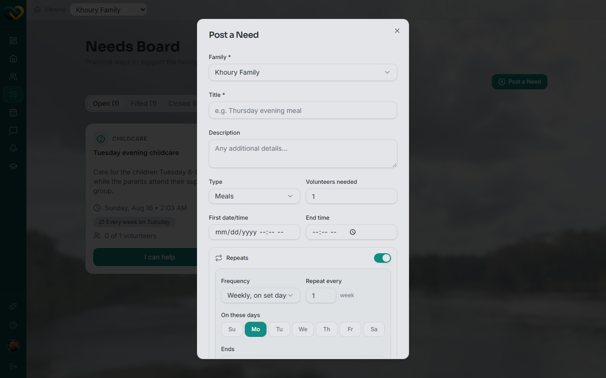

# Create a recurring need

**Who this is for:** Advocate, Lead Volunteer
**When to use it:** To ask for ongoing help that repeats on a schedule — a weekly meal, a standing ride, regular childcare.
**Before you start:** Nothing — you can post a need for any family you serve.

## Steps

1. Click **Post a Need**.
2. Fill in Family, Title, Type, and the rest of the one-time fields as usual.
3. Turn on the **Repeats** switch — this reveals the recurrence fields.
4. Set **Frequency** (e.g. Weekly), **Repeat every** (e.g. every 1 week), and **On these days** (Su–Sa).
5. Set **Ends** — Never, or an end date.
6. Click **Post Need**.

## What you'll see

A plain-language summary appears under the day picker (e.g. "Repeats every week on Monday — shown on the calendar on every matching day until it's deleted"). The need then appears on the calendar on every date the recurrence rule produces — each occurrence starts as **Unassigned** and can be covered separately.

!!! tip "Changing one occurrence later"
    You don't need to recreate the series to cover a single date differently — see [Assign a volunteer to cover a single day of a recurring need](cover-a-single-day.md).

## Related

- [Create a one-time need](create-a-one-time-need.md)
- [Change volunteer assignments on recurring needs](change-recurring-assignments.md)
