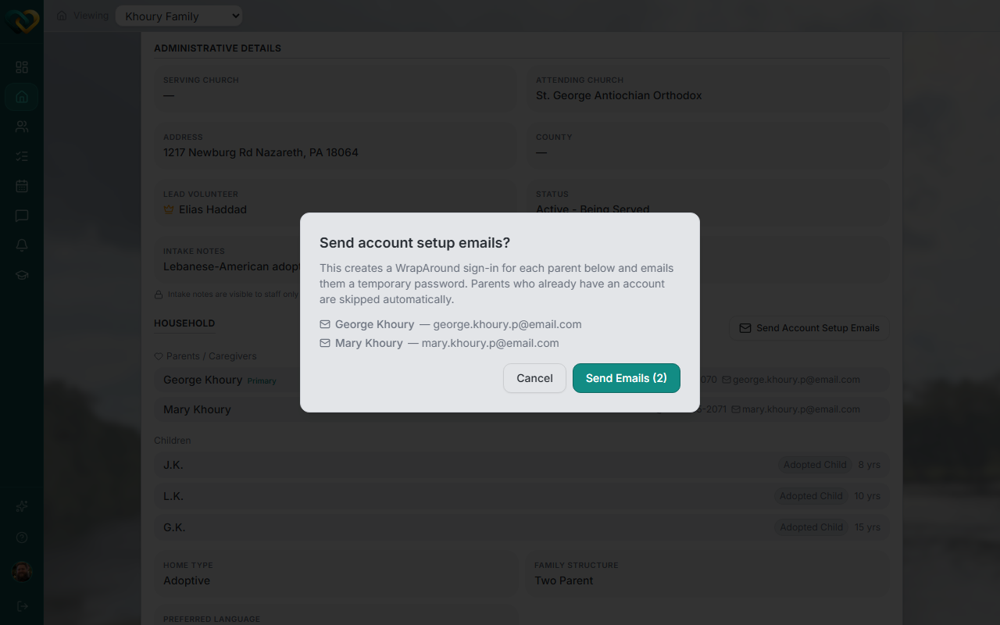

# Invite a family's parents

**Who this is for:** Advocate
**When to use it:** To give a family's parents their own WrapAround sign-in, so they can view their needs, schedule, and messages directly.
**Before you start:** The parent must already be added to the family's Household with an email address on file — see [Add parent or child information](add-parent-or-child-info.md).

## Steps

1. Open the family and scroll to the **Household** section (Overview tab).
2. Click **Send Account Setup Emails**. (This is disabled if no parent on the family has an email address on file.)

    

3. Review the list — parents who already have an account are skipped automatically.
4. Click **Send Email(s) (N)** to confirm.

    

5. Check the results: each parent shows **Email sent**, **Email failed**, **Already has an account**, or **No email on file**.

## What you'll see

Parents with a successfully delivered email receive a temporary password and can sign in themselves — see [Accept your invite](accept-your-invite.md). This creates a WrapAround sign-in for the family; it doesn't change any care-team assignments.

## Related

- [Add parent or child information](add-parent-or-child-info.md)
- [Accept your invite](accept-your-invite.md)
