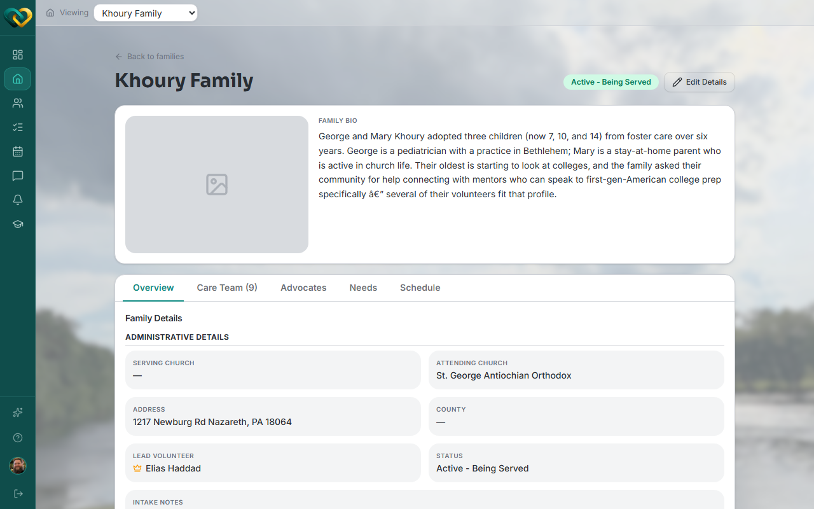

# Manage a family's care team

**Who this is for:** Advocate
**When to use it:** To see who's supporting a family, add a volunteer to the team, or remove one.
**Before you start:** The family must be served by your church.

## Steps

1. Open the family and click the **Care Team** tab (shows the current count, e.g. "Care Team (9)").

    

2. Click **Show all volunteers** to see everyone eligible to be added, or **Show assigned volunteers** to see the current team.
3. To remove someone, click **Remove from care team** next to their name.

## What you'll see

The care team list updates immediately. A volunteer removed from the team loses access to that family's needs, schedule, and messages.

## Related

- [How to assign a volunteer as Lead to a family](assign-a-lead-volunteer.md)
- [How to onboard a new volunteer](onboard-a-volunteer.md)
