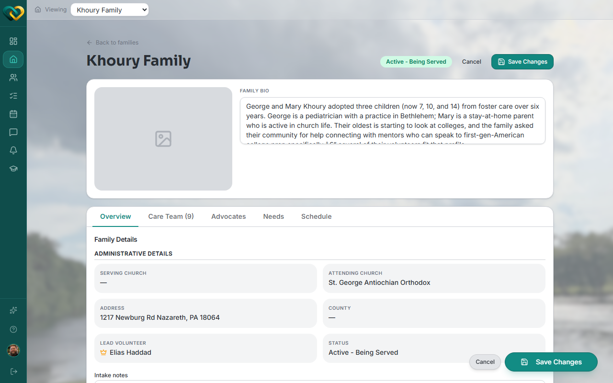

# Modify a family's profile

**Who this is for:** Advocate
**When to use it:** To update a family's church assignment, address, county, status, or other administrative details.
**Before you start:** The family must be served by your church.

## Steps

1. Go to **Families** and open the family.

    

2. Click **Edit Details**.
3. Update the fields you need to change — Attending Church, Address, County, Status, and similar Administrative Details.

    

4. Click **Save Changes**.

## What you'll see

The updated details appear immediately on the family's **Overview** tab.

!!! tip "Serving Church is greyed out"
    As an advocate, you can't change a family's **Serving Church** — that field is locked to admins and coordinators. This is why: changing it could move the family out of your church's care and out of your own access.

## Related

- [How to manage a family's care team](manage-a-familys-care-team.md)
- [Roles & who sees what](../../concepts/roles-and-visibility.md)
