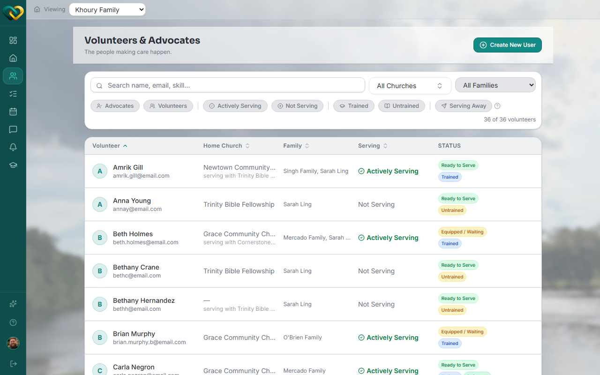
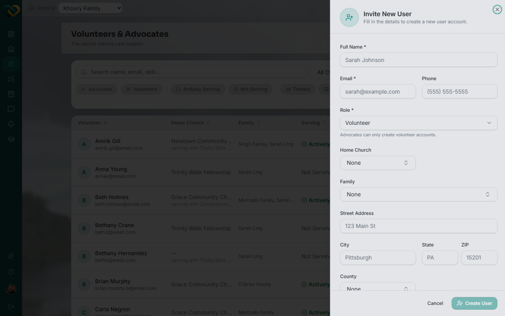

# Onboard a new volunteer

**Who this is for:** Advocate
**When to use it:** When someone from your church wants to start volunteering with a family.
**Before you start:** You'll need the volunteer's full name and email address.

## Steps

1. Go to **Volunteers**.
2. Click **Create New User** (top right).

    

3. In the **Invite New User** panel, enter the volunteer's full name, email, and optionally phone, home church, family, and address.
4. Leave the role as **Volunteer** — the form tells you "Advocates can only create volunteer accounts," and no other role is offered.
5. Click **Create User**.

    

## What you'll see

The new volunteer appears in your Volunteers list with a **Prospect** status. They'll receive an email with a temporary password — see [Accept your invite](accept-your-invite.md) for what happens next on their end. They start in the `new_volunteer` training track and won't show as active until they've completed training and been assigned to a family.

!!! tip "Invite didn't go through?"
    If you get an error that the email already has an account, that person already exists in WrapAround — check [How to view volunteer details](view-volunteer-details.md) instead of re-inviting them.

## Related

- [How to view volunteer details](view-volunteer-details.md)
- [How to assign a volunteer as Lead to a family](assign-a-lead-volunteer.md)
