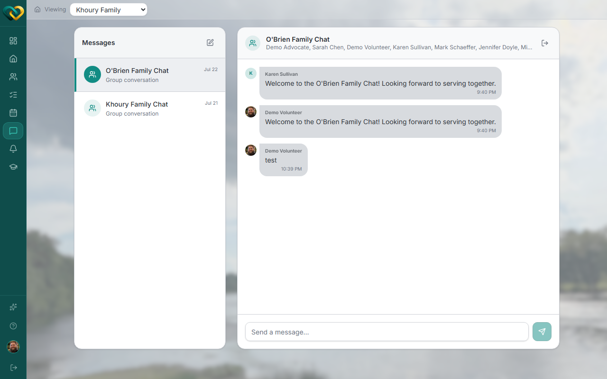

# Reply to a message & read receipts

**Who this is for:** Advocate
**When to use it:** To respond in an existing conversation and understand what the read indicator means.
**Before you start:** You need an existing conversation — see [Start a message thread](start-a-message-thread.md) if you don't have one yet.

## Steps

1. Go to **Messages** and select the conversation from your list.

    

2. Type your reply.
3. Send it.

## What you'll see

Once a recipient opens the thread, your message shows a read indicator. A read receipt means the message was **seen** — it doesn't mean anyone has taken action on it. If you're waiting on a task to be covered, wait for a clear reply or a claim/sign-up, not just a read receipt.

## Related

- [Start a message thread](start-a-message-thread.md)
- [Replies & read receipts (Volunteer)](../messaging/reply-read-receipts.md)
