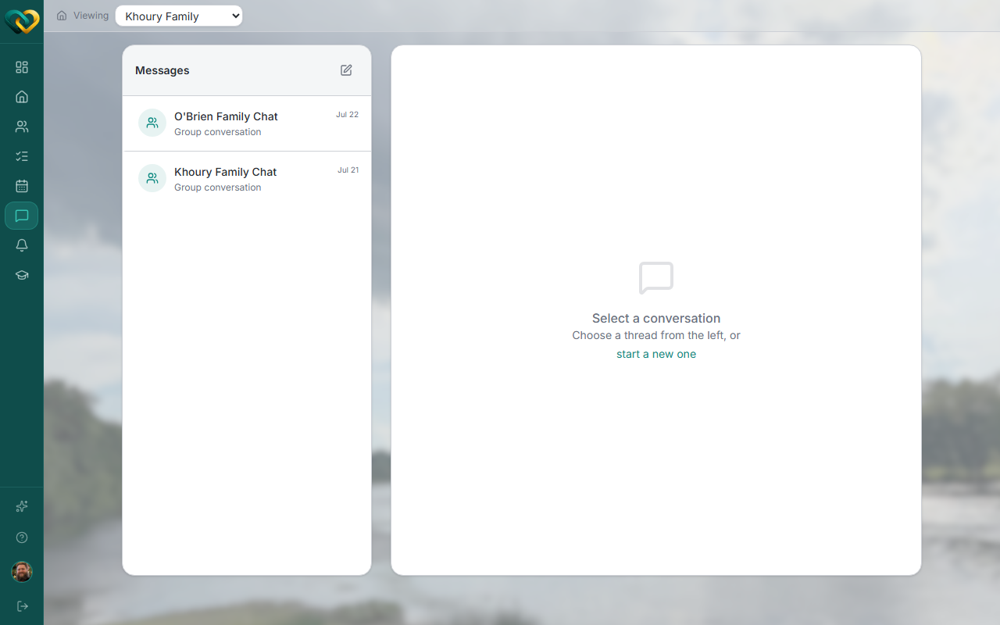
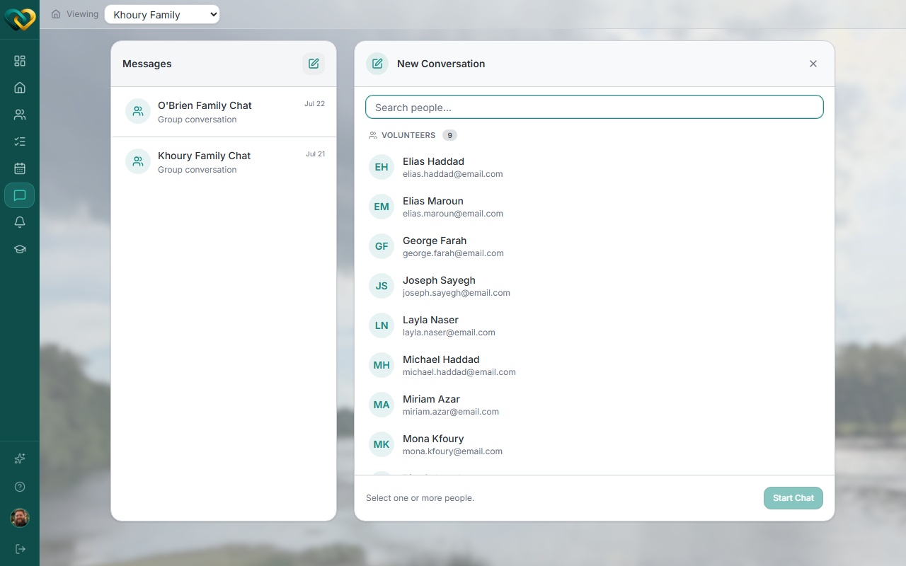

# Start a message thread

**Who this is for:** Advocate
**When to use it:** To message a volunteer, a family, or a group about a family you serve.
**Before you start:** Nothing — anyone signed in can start a thread with people they share a care circle with.

## Steps

1. Go to **Messages**.

    

2. Click **New conversation**.
3. Choose **Direct message** (one person) or **Group conversation** (multiple people).
4. Select the recipient(s) — you can message Volunteers or Family Members.

    

5. Click **Start Chat**.

## What you'll see

The new thread opens and you can start typing right away. It also appears in your conversation list for later.

## Related

- [Reply to a message & read receipts](reply-and-read-receipts.md)
