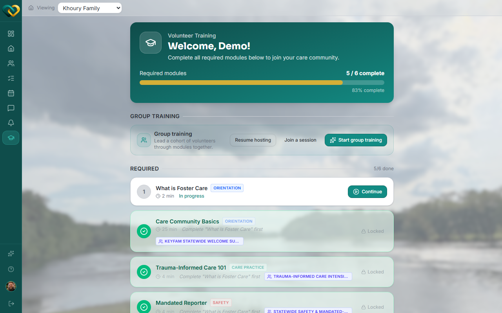
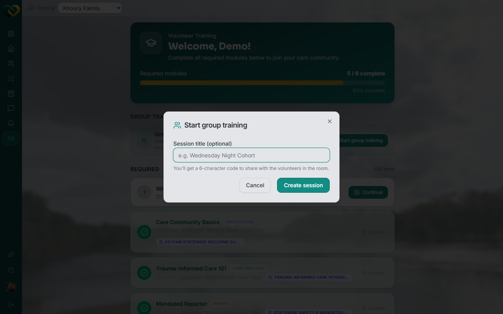

# Start a group training session

**Who this is for:** Advocate
**When to use it:** To lead a live training session for multiple volunteers at once, instead of each person completing modules on their own.
**Before you start:** Nothing — the **Group training** panel is available on your Training page whether or not you've finished your own required modules.

## Steps

1. Go to **Training**.

    

2. Under **Group training**, click **Start group training**.
3. Optionally give the session a title.
4. Click **Create session**.

    

## What you'll see

A 6-character code is generated for you to share with the volunteers in the room — that's what they use to [join](manage-group-training.md).

!!! tip "Already have training left to finish yourself?"
    Hosting a group session doesn't require your own required modules to be complete — the Group training panel sits alongside your personal progress, not behind it.

## Related

- [Join/manage a live group training](manage-group-training.md)
- [View attendees of a group training](view-training-attendees.md)
