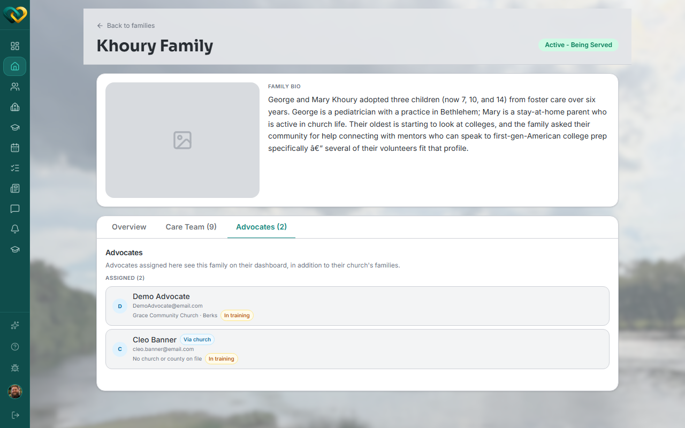

# View individually assigned advocates for a family

**Who this is for:** Advocate
**When to use it:** To check whether a family has an advocate individually assigned to it, beyond the general access every advocate at their church has.
**Before you start:** The family must be served by your church.

## Steps

1. Open the family and click its **Advocates** tab.
2. Review the **Assigned** list of advocates tied to this specific family.

    

## What you'll see

Any advocate(s) individually tied to this specific family, separate from the church-wide access every advocate at that church already has to every family the church serves.

## Related

- [Roles & who sees what](../../concepts/roles-and-visibility.md)
