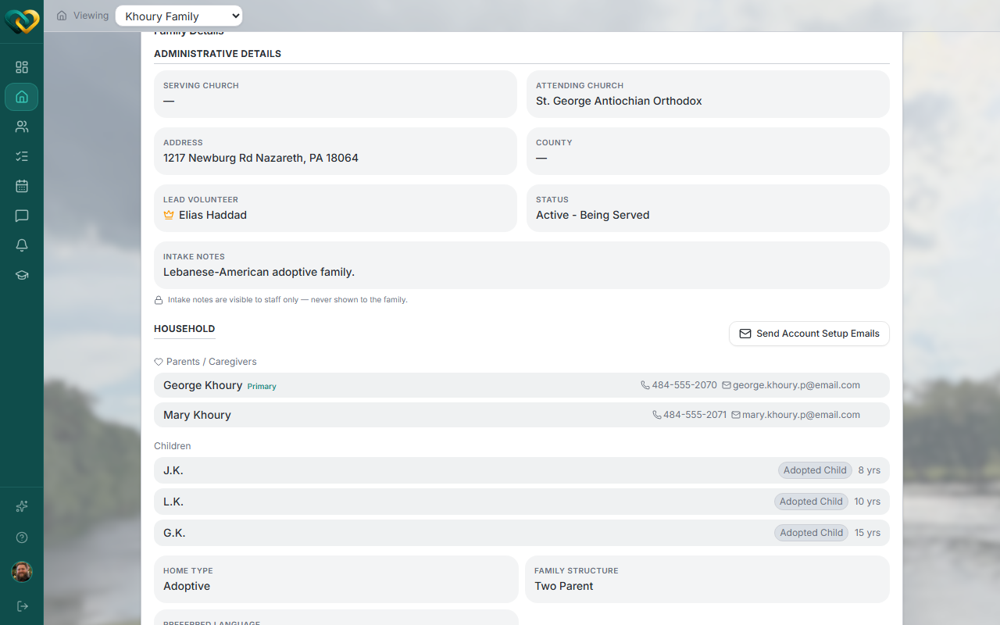

# View child information

**Who this is for:** Advocate
**When to use it:** To check details on a child in a family you serve — birthdate, relationship to the family, and similar.
**Before you start:** The family must be served by your church.

## Steps

1. Open the family and scroll to the **Household** section on the Overview tab.
2. Find the child under **Children**.

## What you'll see

Children are listed by **initials** (not full name), with their relationship (e.g. Adopted Child) and age. Advocates see the same level of detail on a child as an admin does; nothing is hidden or redacted for this role.

## Related

- [Add parent or child information](add-parent-or-child-info.md)
