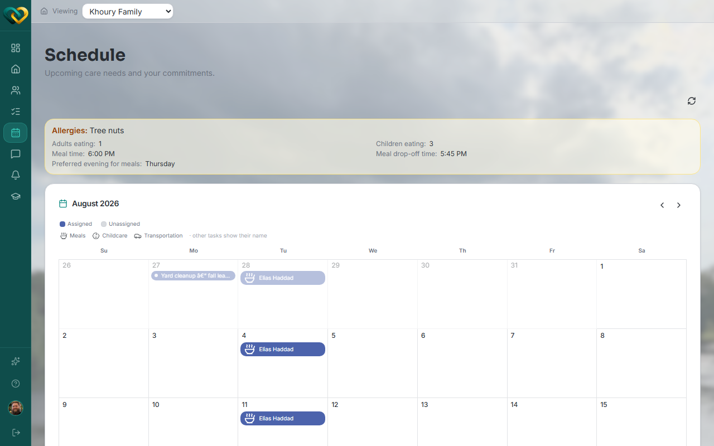
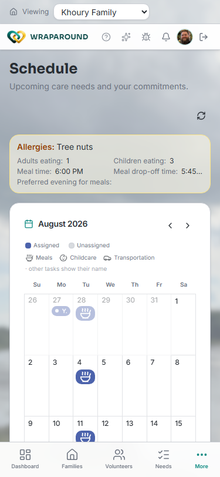

# View the schedule

**Who this is for:** Advocate
**When to use it:** To see a family's upcoming needs and commitments laid out by day, week, or month.
**Before you start:** The family must be served by your church.

## Steps

1. Select the family from the family switcher at the top of the page.
2. Click **Schedule** in the left nav.
3. Use the arrows next to the month to move forward or back.
4. Click any day with an entry to see its details.

    

!!! tip "On mobile"
    The mobile calendar shows an icon badge per day instead of names — tap the badge to open the same day-detail dialog.

    

## What you'll see

A calendar with each need or recurring event marked by type (Meals, Childcare, Transportation, or other), colored to show **Assigned** vs. **Unassigned**. Clicking a specific occurrence opens its detail dialog, where you can reassign, request coverage, reschedule, or cancel that date.

## Related

- [Request coverage on behalf of a volunteer](request-coverage.md)
- [Assign a volunteer to cover a single day of a recurring need](cover-a-single-day.md)
