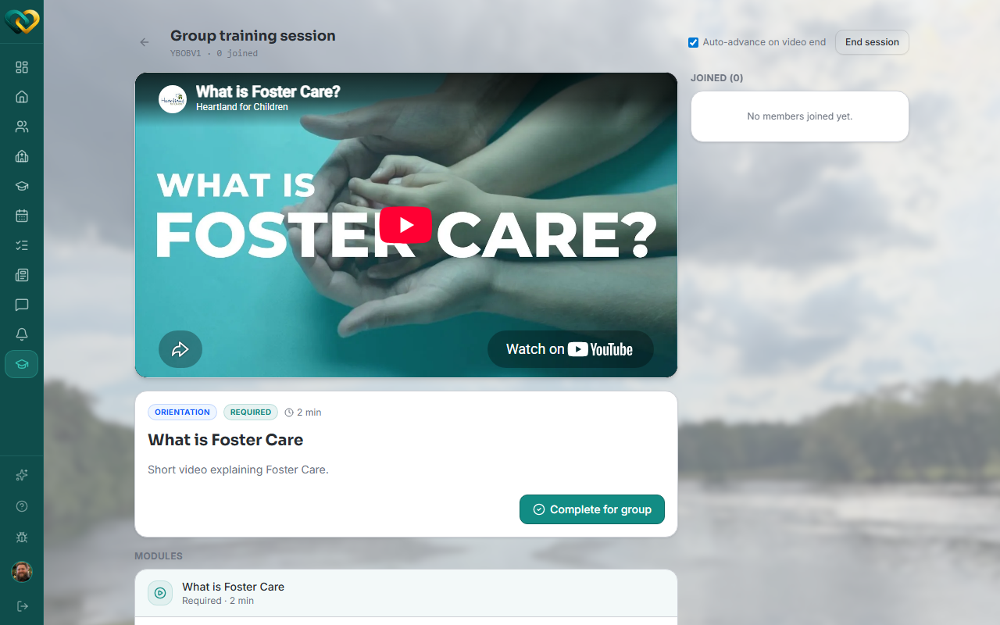

# View attendees of a group training

**Who this is for:** Advocate
**When to use it:** To check who joined a group training session and whether they were marked complete.
**Before you start:** The session must be live or completed.

## Steps

1. Open the session from **Training**.
2. Review the **Joined** attendee list.

    

3. If someone joined by mistake, click **Remove** next to their name.

## What you'll see

Each attendee's completion status, and whether the module they attended was Required or Optional.

## Related

- [Join/manage a live group training](manage-group-training.md)
