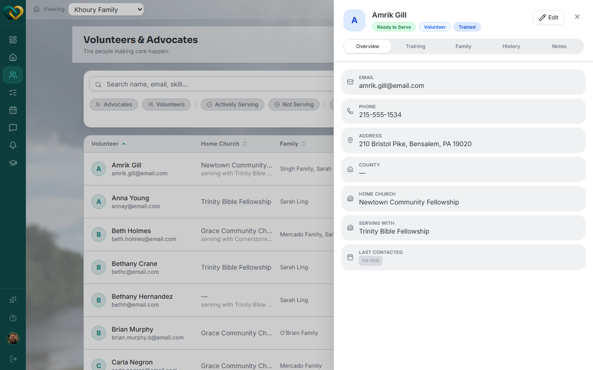

# View volunteer details

**Who this is for:** Advocate
**When to use it:** To check a volunteer's status, training progress, or which family/families they're assigned to.
**Before you start:** Nothing — anyone signed in as an advocate can do this for volunteers at their church.

## Steps

1. Go to **Volunteers**.
2. Click a volunteer's name to open their profile.
3. Review the **Overview** tab for their status, assigned family/families, and training progress.
4. Switch to the **Details** tab for their contact and profile information, or **Training & Certs** for a module-by-module breakdown.

    

## What you'll see

Training modules show as **Completed** or **In progress**, and the account itself shows **Approved** or **Not approved**.

## Related

- [How to onboard a new volunteer](onboard-a-volunteer.md)
- [Roles & who sees what](../../concepts/roles-and-visibility.md)
