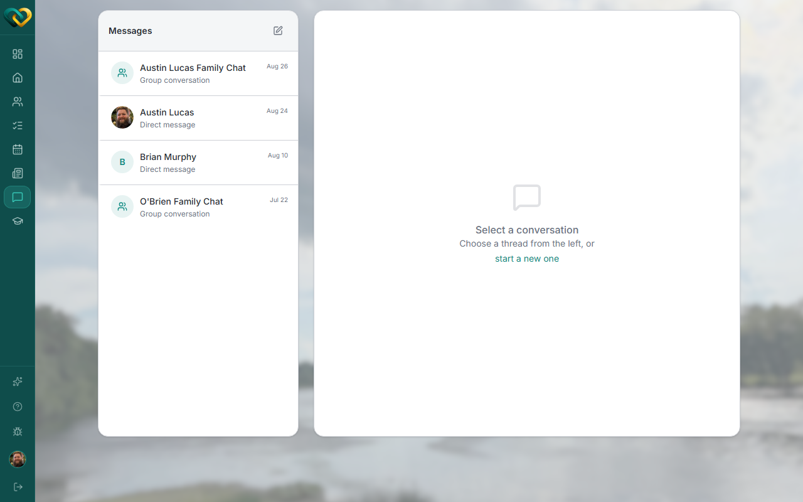
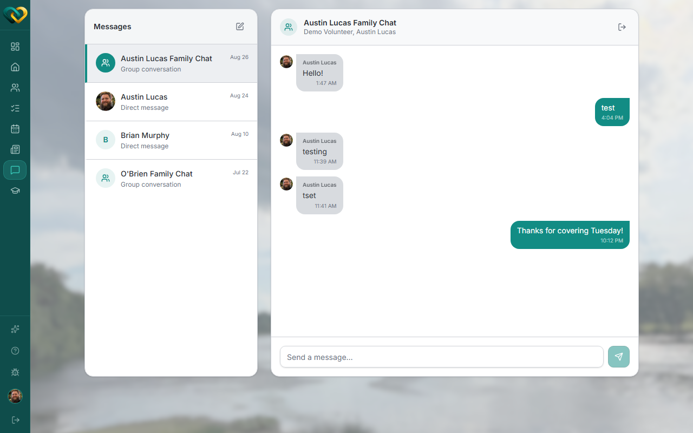

<!-- @frontend verified live 2026-08-26 as WA_VOLUNTEER_USER against
     https://demo.wraparound.lucasalign.com/messages. Correcting the draft: there is no
     read-receipt indicator anywhere in the thread UI (no "Seen" label, no checkmark, no
     names) — confirmed both visually and by searching the frontend source for
     read-receipt/seen-at handling, which turned up nothing message-related. Read
     receipts are not built. Splitting this into a working "Reply" section and a
     not-built "Read receipts" section, matching this repo's convention for confirmed
     unbuilt features (see notifications.md). -->

# Reply to a thread

**Who this is for:** Volunteers, advocates, and program staff.
**When to use it:** When you're keeping a conversation going.
**Before you start:** You're in a [thread](start-thread.md), or someone has messaged you.

## Steps

1. Open **Messages** and select the thread from the list on the left.

    

2. Type in the **Send a message…** box at the bottom and press **Enter** (or click the
   send arrow). Your reply joins the conversation, newest at the bottom.

    

## What you'll see

The conversation in order, with the latest message at the bottom.

!!! warning "Read receipts aren't available yet"
    WrapAround doesn't show who's read a message — there's no "Seen" indicator, checkmark,
    or list of names anywhere in a thread. If you need to confirm someone got your
    message, ask them directly or wait for a reply.

## Related

- [Start a thread](start-thread.md)
- [Notifications](notifications.md)
