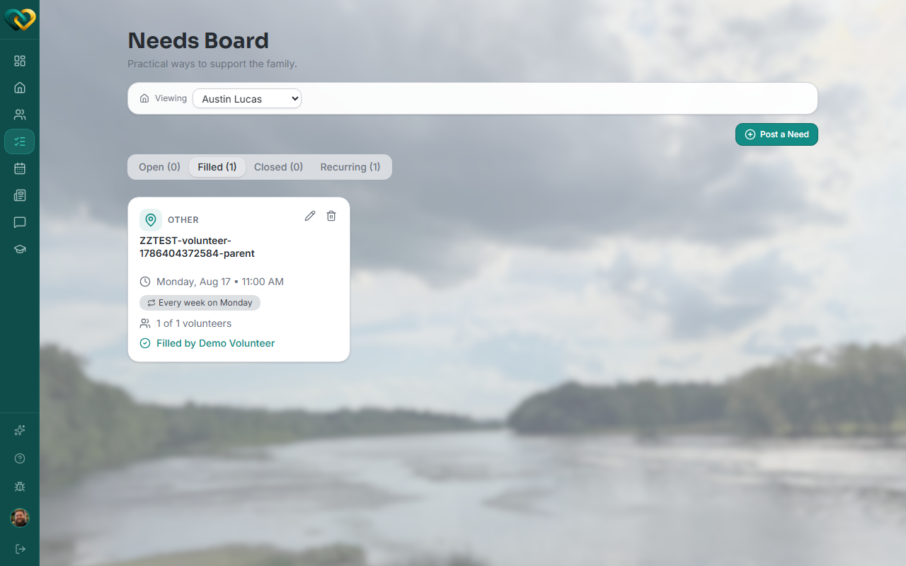
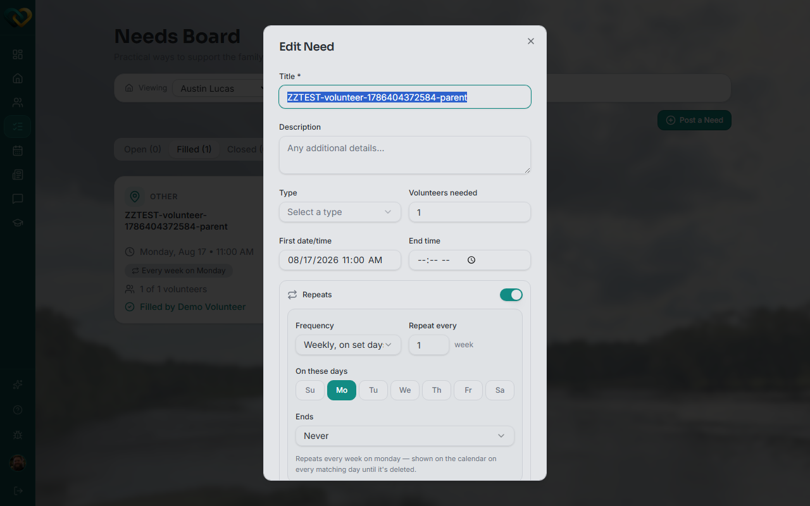
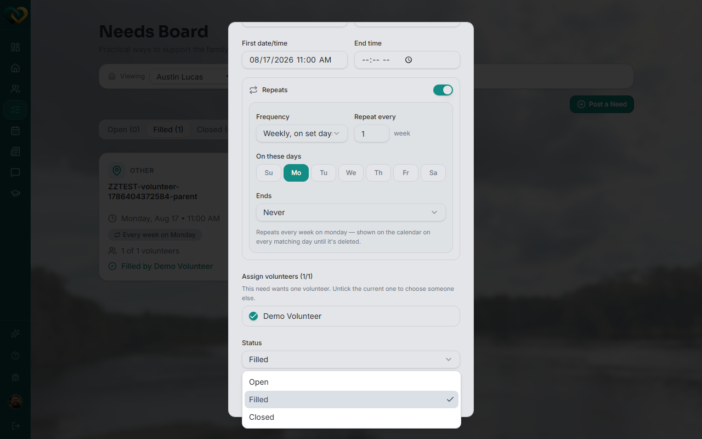

<!-- @frontend verified live 2026-08-26 as WA_VOLUNTEER_USER (Lead Volunteer on its own
     family) against https://demo.wraparound.lucasalign.com/needs. Correcting the draft:
     there is no "Mark complete" button. Closing out a need happens through the same
     Edit Need modal used to change any other field — a Status dropdown with Open /
     Filled / Closed. The pencil (edit) icon only appears on cards for someone who can
     manage the family's needs (Lead Volunteer, advocate, staff). -->

# Mark a need complete

**Who this is for:** Lead Volunteers, advocates, and program staff — the people who can
update a need.
**When to use it:** Once a need has been taken care of, so the family and team know it's done.
**Before you start:** The task has been handled. (A support volunteer who finished a task
lets a Lead Volunteer or staff member know so they can close it out.)

## Steps

1. Open **Needs**, switch to the **Filled** tab, and find the need.

    

2. Click the **pencil (edit)** icon on the card to open **Edit Need**.

    

3. Scroll down to **Status** and change it from **Filled** to **Closed**.

    

4. Click **Save Changes**.

## What you'll see

The need moves to the **Closed** tab and no longer appears among **Open** or **Filled**
needs. The family and team can see the task is finished.

!!! note "Who can do this"
    The pencil (edit) icon — and the ability to change a need's status at all — only
    shows up for **Lead Volunteers, advocates, and program staff**. A support volunteer
    who completed a task asks one of them to close it out.

!!! tip "Add a quick note"
    If there's anything the family should know — leftovers in the fridge, where you left a
    package — share it in [the message thread](../messaging/start-thread.md).

## Related

- [Claim a need](claim-a-need.md)
- [Withdraw a claim](withdraw-a-claim.md)
- [Statuses explained](../../reference/statuses.md)
