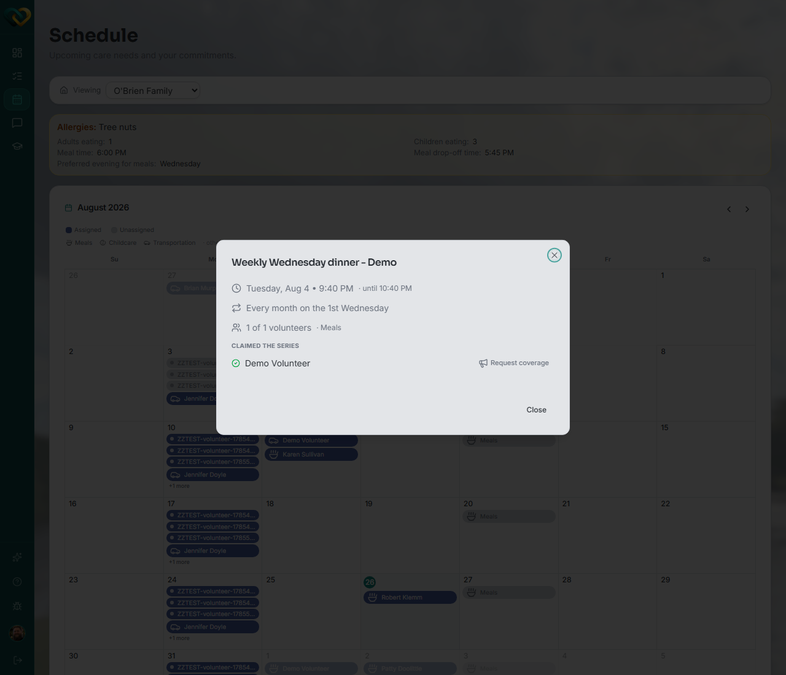

<!-- @frontend verified live 2026-08-26 as WA_VOLUNTEER_USER (a Lead Volunteer account,
per CLAUDE.md and WrapAround-Testing-Suite's config/roles.ts). This account is Lead only
on its own family ("Austin Lucas"); switching the family dropdown to a family it's just a
plain assigned volunteer on (e.g. "O'Brien Family") and opening a day it has claimed shows
exactly the plain-volunteer view this page describes: no "Modify this day" manager card,
just the "Claimed the series" row with the volunteer's own name and a single Request
coverage control next to it. Confirms the source-level prediction in need-detail-dialog.tsx
(coverageControl() renders for the claim holder when canManage is false). -->

# Request coverage on a need you've claimed

**Who this is for:** Volunteer (on your own claim).
**When to use it:** You've claimed a need or a recurring slot but might not be able to
make it, and want to ask the care community for a replacement — without giving up the
slot yet.
**Before you start:** You've already [claimed](claim-a-need.md) the need or occurrence.

## Steps

1. Go to **Schedule**.
2. Click the day with the occurrence you claimed. If more than one item falls on that
   day, a short list opens first — click through to the specific occurrence to open its
   detail dialog.
3. Find your own name under **Claimed the series** (or the plain occurrence details for a one-time need). Next to it, click **Request coverage**.

    

## What you'll see

The care community is emailed that this slot needs a different volunteer. **You stay
assigned** — this only asks for backup, it doesn't remove you from the slot. If no one
steps in, you still hold it; if you can no longer do it at all, use
[Withdraw a claim](withdraw-a-claim.md) instead to release it outright.

For a recurring need, requesting coverage only affects the **date you opened** — your
assignment on every other occurrence in the series is untouched.

!!! tip "Not the same as withdrawing"
    **Request coverage** asks for backup while you keep the slot. **Withdraw** gives the
    slot up completely and returns it to the open list. Use whichever matches what you
    actually need.

## Related

- [Withdraw a claim](withdraw-a-claim.md)
- [Claim a need](claim-a-need.md)
- [Request coverage on behalf of a volunteer](../advocate/request-coverage.md) — the
  same control, used by an advocate or lead volunteer on someone else's claim.
