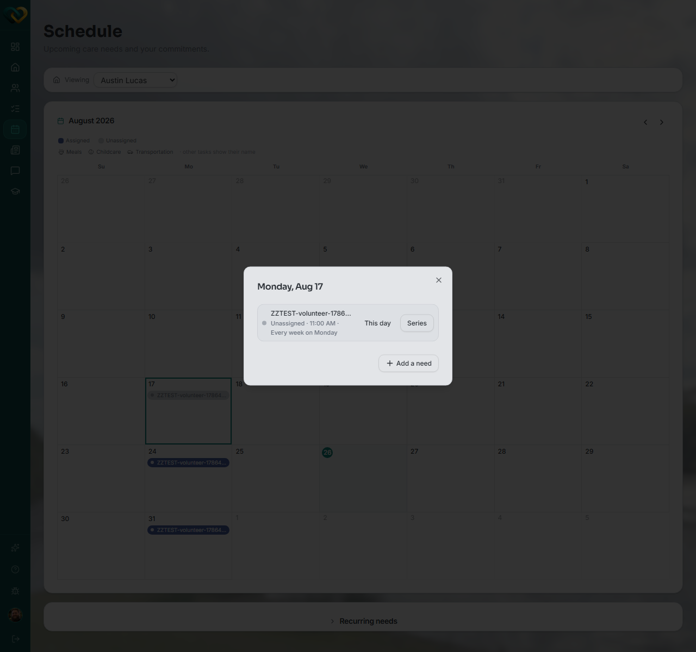
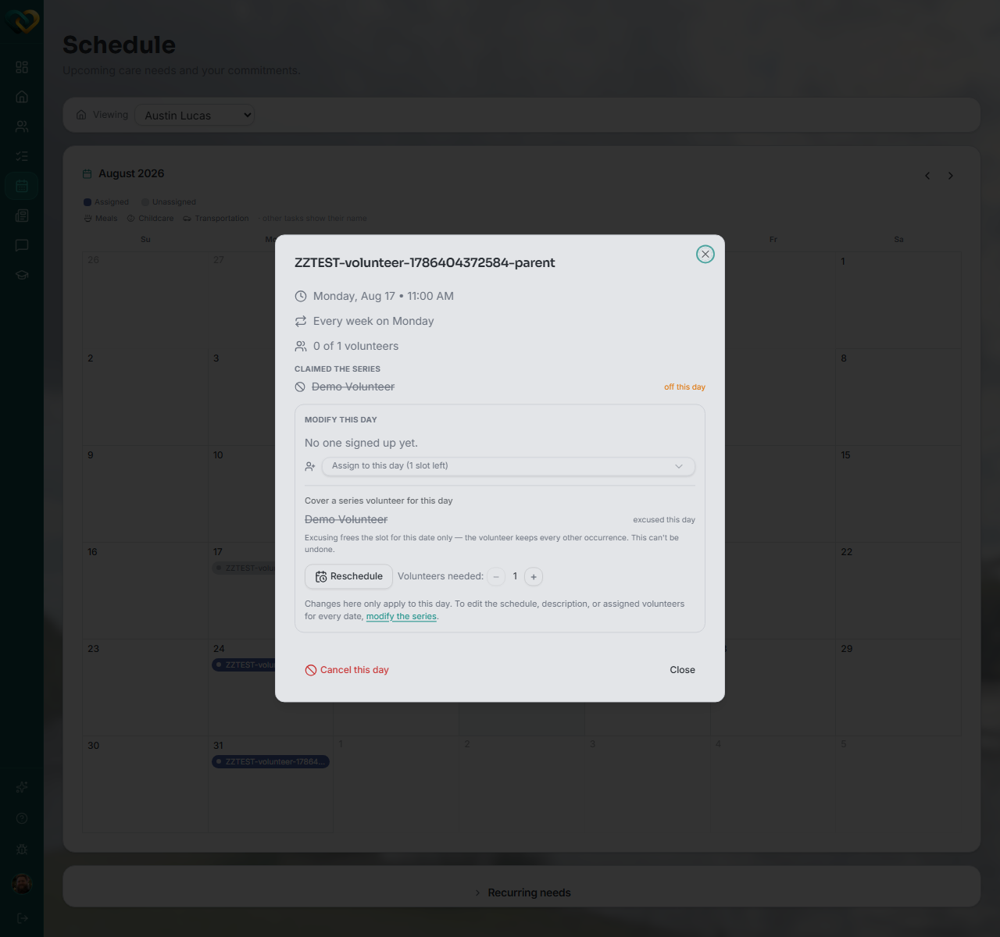

<!-- @frontend verified live 2026-08-26 as WA_VOLUNTEER_USER against
     https://demo.wraparound.lucasalign.com, and against need-detail-dialog.tsx in
     Align-FrontEnd. Correcting the draft substantially: there is no self-service
     "Withdraw" button for a plain volunteer on their own claim — coverageControl() in
     the source only ever renders a "Request coverage" action for the claim holder
     (see request-coverage.md, already written by the other agent this session). The
     only way a claim is released outright is a Lead Volunteer / advocate / staff member
     "excusing" the volunteer for that day (recurring needs) or unassigning/deleting the
     need (one-time needs) — both require canManage. Retargeting this page's audience
     accordingly and pointing plain volunteers to request-coverage.md instead. -->

# Withdraw a claim

**Who this is for:** Lead Volunteers, advocates, and program staff — the people who can
release someone else's claim outright.
**When to use it:** A volunteer can no longer do a need they claimed and nobody has
picked up their [coverage request](request-coverage.md), so you need to free the slot
for someone else.
**Before you start:** The need is [claimed](claim-a-need.md) by the volunteer you're
releasing.

!!! warning "If you're the volunteer who claimed it"
    You can't withdraw your own claim directly. Use
    [**Request coverage**](request-coverage.md) instead — it asks the care community for
    a replacement while you keep the slot. If you truly can't do it and no one steps in,
    ask a Lead Volunteer, advocate, or staff member to release you using the steps below.

## Steps

### For a recurring need (one occurrence)

1. Go to **Schedule** and click the day with the occurrence.

    

2. Click **This day** to open the day's detail dialog.
3. Next to the volunteer's name, click **excused this day** (shown under "Cover a series
   volunteer for this day").

    

4. Confirm. This can't be undone.

### For a one-time need

1. Go to **Needs**, find the need, and click the **pencil (edit)** icon on its card.
2. Under **Assign volunteers**, untick the volunteer's name to remove them, or change
   **Status** back to **Open**.
3. Click **Save Changes**.

## What you'll see

- **Recurring, one day:** that date frees up and shows **0 of 1 volunteers** again. The
  volunteer keeps every other occurrence in the series untouched.
- **One-time need:** the need returns to the **Open** list for someone else to claim.

!!! tip "Coverage requests come first"
    Most of the time, a volunteer who can't make it uses
    [**Request coverage**](request-coverage.md) themselves — it notifies the care
    community without giving up their slot. Reach for this page only when that hasn't
    worked and the slot genuinely needs to be freed.

## Related

- [Request coverage on a need you've claimed](request-coverage.md)
- [Claim a need](claim-a-need.md)
- [Browse open needs](browse-needs.md)
