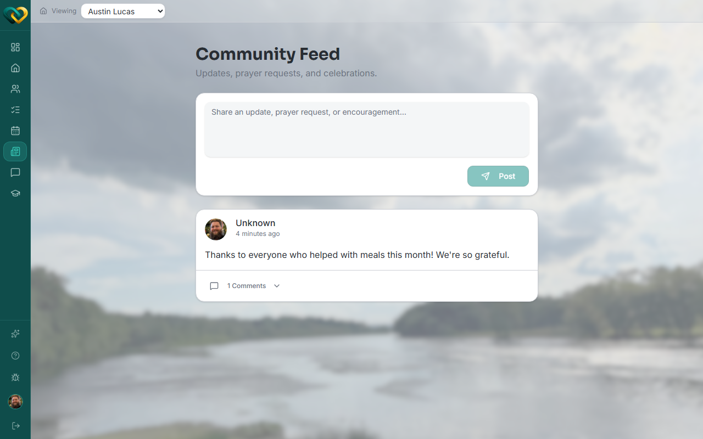
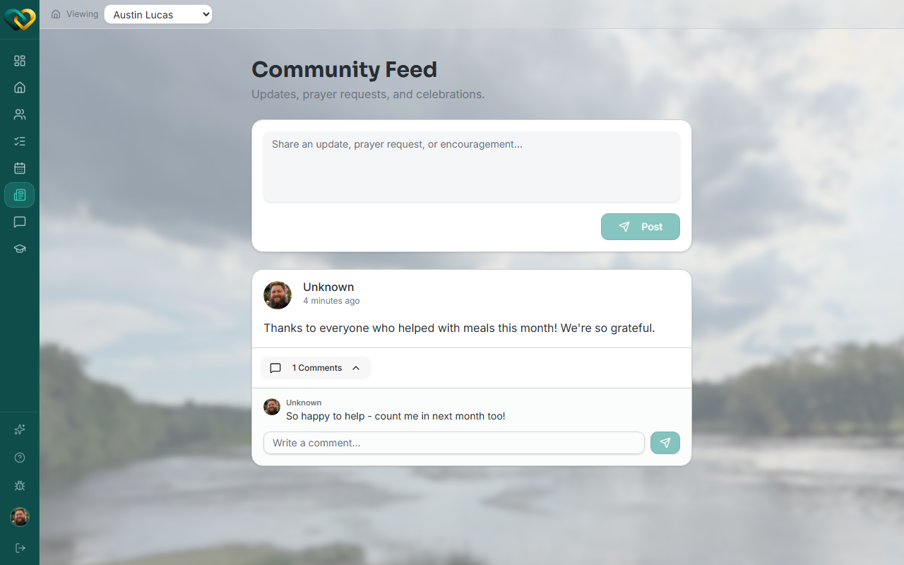

<!-- @frontend verified live 2026-08-26 as WA_VOLUNTEER_USER against
     https://demo.wraparound.lucasalign.com/feed. Correcting the draft: Posts (the
     "Community Feed", at /feed) is NOT available to a plain support volunteer. Switching
     the family dropdown to a family this account is only a plain volunteer on (not
     Lead) drops "Posts" from the sidebar entirely, and navigating to /feed directly
     shows "You don't have access to this page." It only worked when viewing the
     account's own family, where it's Lead. Retargeting the audience to match, and
     correcting composer details: there's no separate title field (a single "Share an
     update..." box), and the comment box only appears after expanding the "N Comments"
     row under a post. -->

# Read & comment on posts

**Who this is for:** Lead Volunteers, advocates, and program staff.
**When to use it:** To catch up on your family's news and join the conversation.
**Before you start:** You've [accepted your invite and signed in](../account/accept-invite.md),
and you're a Lead Volunteer, advocate, or staff member on the family.

!!! warning "Not available to every volunteer"
    A support volunteer who isn't Lead on a family doesn't see **Posts** in the sidebar
    for that family, and going to the feed directly shows "You don't have access to this
    page." Posts is limited to Lead Volunteers, advocates, and program staff.

## What a post is

A **post** is an update shared with your care circle — for example an announcement, a
general update, a prayer request, or a celebration. Posts are a single freeform message
(there's no separate title field). You can add a **comment** to join the conversation.

## Steps

1. Open **Posts** from the sidebar. This opens the **Community Feed**.

    

2. Read the latest posts — newest first.
3. To respond, click the **N Comments** row under a post to expand it, then type in
   **Write a comment…** and press **Enter** (or click the send arrow).

    

## What you'll see

The circle's recent posts and their comments. Your comment appears under the post for
the rest of the circle to see.

!!! tip "A little encouragement goes a long way"
    A quick reaction or kind comment on a celebration or prayer post means a lot to a
    family.

## Related

- [Notifications](../messaging/notifications.md)
- [Start a thread](../messaging/start-thread.md)
