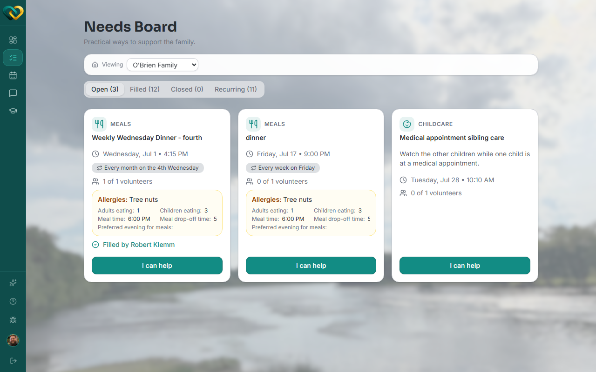
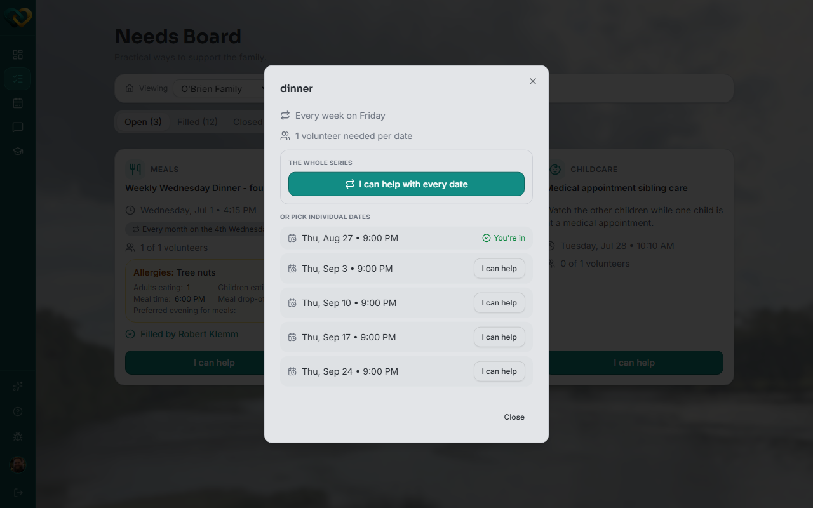

<!-- @frontend verified live 2026-08-26 as WA_VOLUNTEER_USER against
     https://demo.wraparound.lucasalign.com/needs and /schedule. Correcting the draft:
     signing up for a slot happens on the Needs board, not directly on the Schedule
     calendar — clicking an unassigned pill on the Schedule calendar itself does nothing
     (it isn't interactive). The Needs board's "I can help" button is the actual sign-up
     control; for a recurring need it opens a picker with "I can help with every date"
     plus individual dates. Once claimed, the commitment then shows up on Schedule. -->

# Sign up for a slot

**Who this is for:** Volunteers (advocates and program staff can do this too).
**When to use it:** When there's an open need or a recurring slot you can cover.
**Before you start:** You're assigned to the family. You can also
[view the calendar](view-calendar.md) to see what's already covered.

## Steps

1. Open **Needs**. Open needs (nobody signed up yet) appear under the **Open** tab.

    

2. Read the details — **what's needed**, **when**, and any notes.
3. Make sure you can commit to it.
4. Click **I can help**.
    - For a **one-time** need, this claims it immediately.
    - For a **recurring** need, a picker opens — choose **I can help with every date**
      to take the whole series, or pick one or more individual dates.

    

5. The need (or the date you picked) now shows **your name**, and it's added to your
   schedule.

## What you'll see

- The need shows you as the volunteer, and the rest of the team can see it's covered.
- It appears on your [Schedule](view-calendar.md) so you can find it again.

!!! tip "If your plans change"
    If you claimed a slot but can no longer make it, use
    [**Request coverage**](../needs/request-coverage.md) — it asks the care community for
    backup without giving up your spot right away.

## Related

- [View the calendar](view-calendar.md)
- [Understand recurring events](recurring-events.md)
- [Request coverage on a need you've claimed](../needs/request-coverage.md)
