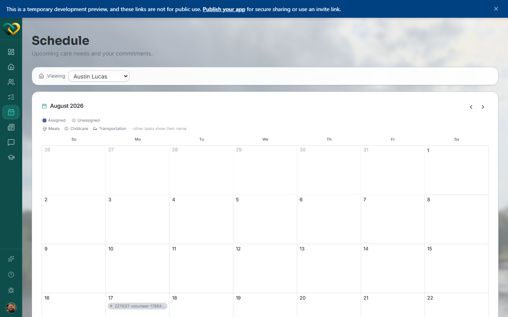

<!-- @frontend verified 2026-08-27 against the dev instance, signed in as the demo
Volunteer: Schedule page is a month grid with a Viewing family selector and an
Assigned/Unassigned legend by task type (Meals, Childcare, Transportation, etc). No
separate "Upcoming" list was found alongside the grid this pass — the page is the
month calendar itself. -->

# View the calendar

**Who this is for:** Volunteers, advocates, and program staff.
**When to use it:** To see what's coming up for your family and when help is needed.
**Before you start:** You've [accepted your invite and signed in](../account/accept-invite.md),
and you're assigned to a family.

## Steps

1. From the main menu, open **Schedule**.
   You'll see your family's calendar as a **month grid**, with a legend showing which task
   types (Meals, Childcare, Transportation, and others) are **Assigned** vs.
   **Unassigned**.
2. Each day shows its scheduled **events** and **commitments** (needs someone's claimed) —
   tap a day to see its full details.
3. Use the **‹ ›** arrows next to the month name to move between months.

## What you'll see

Your family's upcoming events and your own commitments. The Schedule is view-only — to
take on something new, [claim a need](../needs/browse-needs.md) on the Needs board.

!!! tip "Recurring events"
    Some entries repeat — a weekly ride, for example. See
    [Understand recurring events](recurring-events.md) so you know what you're committing to.

## Related

- [Sign up for a slot](sign-up-slot.md)
- [Understand recurring events](recurring-events.md)
- [Browse open needs](../needs/browse-needs.md)
