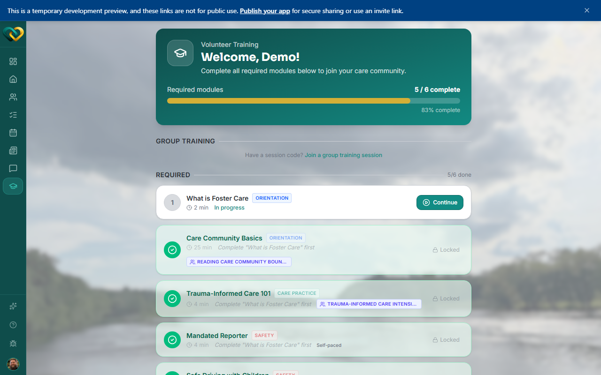

<!-- @frontend verified 2026-08-27 against the dev instance, signed in as the demo
Volunteer: Training page top confirmed live (screenshot shared with
modules-and-progress.md); did not scroll to confirm the standalone "Resources Library"
section described below this pass. -->

# Access training resources

**Who this is for:** Volunteers and advocates completing training.
**When to use it:** When a module points to a video, document, or link you need to read or
watch.
**Before you start:** You can open your [training modules](modules-and-progress.md).

## Steps

1. Open **Training** and select a module.
2. Each module lists its **resources** — the supporting materials attached to it. A resource
   can be a **video**, an **article**, a **link**, or a **PDF**. A standalone **Resources
   Library** also appears on the Training page for materials not tied to a single module.
3. Read or watch each resource, then return to the module to
   [mark it complete](modules-and-progress.md).

## What you'll see

The materials for the module, ready to open. Working through them is what prepares you to
serve a family well.

!!! tip "Come back any time"
    Even after you've finished a module, you can reopen its resources for a refresher.

## Related

- [Find your modules & track progress](modules-and-progress.md)
